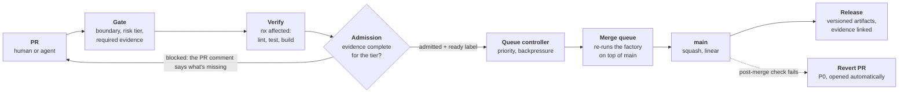
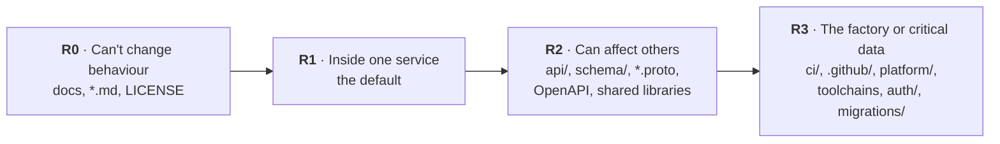
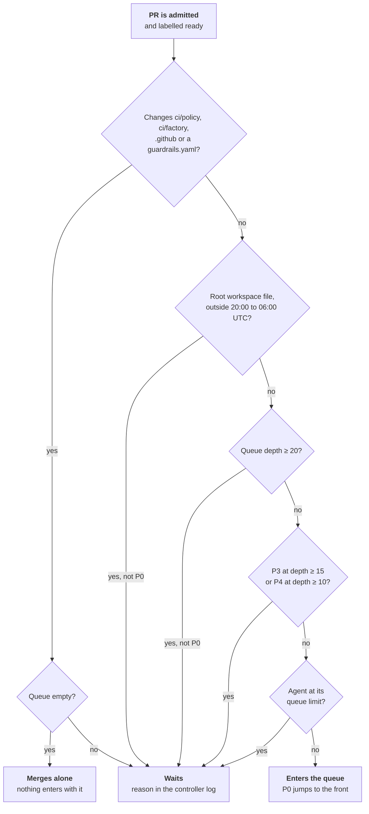
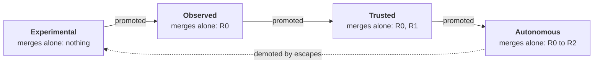

# Monorepo template for a PaaS

A working CI/CD skeleton for a monorepo of about 100 services, built by about 100 developers and 300 agents.

Humans and agents create changes. The factory decides, from evidence and policy, whether each change may merge. Nobody has to know who owns what, how risky a change is or which tests to run: the factory works that out for every PR, records why it allowed or blocked it, and keeps `main` a straight line of squashed, tested commits that is always releasable.

- **One required check.** `factory/admission` compares the evidence a PR has with what its risk tier needs. It is the only status check `main` requires.
- **Risk decides the evidence.** A docs fix needs lint; a change to an API needs contract tests and a mutation score; a change to CI itself needs a human.
- **Agents are workers, not exceptions.** They run through the same pipeline, with provenance, rate limits and a trust level they earn.
- **A merge queue run like a service.** Priorities, backpressure, rule changes merged alone and an automatic revert when `main` goes red.
- **Everything is policy in files.** The rules live in [`ci/policy/`](ci/policy/) and the code that applies them in [`ci/factory/`](ci/factory/), with tests. Changing a rule is a reviewed PR.

The idea behind it is the [Evidence-Driven Software Factory](docs/evidence_driven_software_factory.md); the design this repo implements is the [CI/CD skeleton plan](docs/ci-cd-skeleton-plan.md).

**Contents:** [How a change gets in](#how-a-change-gets-in) · [Risk tiers](#risk-tiers) · [Evidence](#evidence) · [The merge queue](#the-merge-queue) · [How many PRs it can merge](#how-many-prs-it-can-merge) · [Agents](#agents) · [When things go wrong](#when-things-go-wrong) · [Layout](#layout) · [Working in the repo](#working-in-the-repo) · [Setting up a copy](#setting-up-a-copy-of-this-template)

## How a change gets in

Every PR, from a human or an agent, runs the same [`factory`](.github/workflows/factory.yml) workflow on the PR, again in the merge queue, and once more on `main`.



1. **Gate.** Works out the PR's boundary, risk tier, required evidence and approvers. It runs from the base branch, so a PR is never judged by rules it changes itself.
2. **Verify.** Nx runs lint, tests and builds for the projects the change affects, and nothing else. Each step writes an evidence record for the exact commit. Draft PRs run only the gate.
3. **Admission.** Compares the evidence with what the tier requires and posts one PR comment: tier, required versus present evidence, and what to fix.
4. **Queue controller.** A PR labelled `ready` that admission allowed enters GitHub's merge queue by priority, then age.
5. **Merge queue.** Re-runs the factory on `main` plus everything ahead of it, then squash-merges. `main` only ever gets a commit that passed on top of the latest `main`.
6. **Release.** Each affected project is versioned from git tags (`<service>/v<semver>`, bump from the PR title) and its artifacts are published. Nothing is deployed for real; projects with a Helm chart get a simulated preview deploy on their PR.

## Risk tiers

The tier says how much a change could break, and so how much evidence it needs. The gate sets it from the paths a PR touches ([`risk.yaml`](ci/policy/risk.yaml)); files no rule matches are R1.



On top of the paths:

- **At least R2** when more than 10 projects are affected, or any affected project is `criticality: critical`.
- **At least R3** for a boundary override or a major version bump (`feat!:`).
- **One tier up** for an owner's protected path, a service with weak test history, an agent above its trust level, more than three owning teams, or an affected project with a quarantined test.
- **Never R0 for tests.** A test-only change runs at least the changed project's tests, and removing tests needs the owner's approval.

## Evidence

Evidence is a record that a check ran on the exact commit, and its result. [`evidence.yaml`](ci/policy/evidence.yaml) lists what each tier needs. Every check is either **enforce** (missing or failed blocks the merge) or **shadow** (recorded, never blocks). New checks start in shadow and move to enforce once their shadow results show no false blocks, so a new rule can't stop every PR on its first day.

| Evidence | R0 | R1 | R2 | R3 | Mode today |
| --- | --- | --- | --- | --- | --- |
| Boundary, conventional title, no merge commits, lint | ✓ | ✓ | ✓ | ✓ | enforce |
| Feedback time within the tier's budget | ✓ | ✓ | ✓ | ✓ | shadow |
| Build, unit tests |  | ✓ | ✓ | ✓ | enforce |
| Dependency rules, diff coverage, coverage ratchet, test quality, allowed network hosts, Feature-Id, owner approval |  | ✓ | ✓ | ✓ | shadow |
| Contract tests, selected integration tests, mutation score on the diff |  |  | ✓ | ✓ | shadow |
| Broad integration tests |  |  |  | ✓ | shadow |

Some evidence is added on top of any tier, all enforced: agent provenance and trust level on agent PRs, the owner's own checks from `guardrails.yaml` when their paths change, and on an `escape-fix` PR a regression test that fails without the fix. Removing tests adds the owner's approval.

How the evidence stays trustworthy:

- **Judged from the base branch.** The gate and admission code come from `main`, not the PR.
- **Results come from GitHub.** Admission reads each job's conclusion from the GitHub API, not just the record the job wrote.
- **Carried to `main` only when proven.** After a merge, the [`evidence`](.github/workflows/evidence.yml) collector links the PR's evidence to the commit on `main` only if their git trees match, signs the bundle (HMAC-SHA256) and writes it to a write-once bucket when one is configured ([`platform/evidence/`](platform/evidence/)). A commit on `main` with no queue evidence is flagged as a break-glass merge.
- **Only `main` writes caches.** PR and queue builds read the Nx and BuildKit caches but never write them, so one PR can't plant a wrong result.

## The merge queue

GitHub's merge queue has no priorities, only "jump to the front". The [queue controller](.github/workflows/queue.yml) decides what enters it and when, from [`queue.yaml`](ci/policy/queue.yaml). It runs when a PR is labelled, when a factory run finishes, and every 10 minutes.

| Priority | Used for | Default for |
| --- | --- | --- |
| P0 | Hotfixes and pure reverts; jumps to the front | |
| P1 | Human interactive work | Humans |
| P2 | Release-critical agent work | |
| P3 | Normal agent work | Agents |
| P4 | Background work, such as promotion bumps | |



- **Rule changes merge alone.** No PR in a batch is ever judged by rules that change in the same batch.
- **Workspace changes wait for off-peak.** Root files like `nx.json` rebuild every project, so they enter only between 20:00 and 06:00 UTC.
- **Backpressure protects humans.** When the queue fills, agent and background work waits; P0 to P2 always enter.
- **Squash only.** The [`main` ruleset](.github/rulesets/main.json) allows only squash merges and linear history, so each PR is one commit on `main` and changelogs are exact.

## How many PRs it can merge

The merge queue is the one place every change passes through, so its throughput is the factory's ceiling. The full derivation, with every assumption and a script to redo it, is in [How many PRs the merge queue can merge](docs/merge-queue-capacity.md). In short:

```text
            B × 60 / T
X  =  ─────────────────────────────    PRs merged per hour
       1 + p / (1 − p) × (B + 1) / 2
```

- **`B`**, entries built at once: 5, from [`merge-queue.json`](.github/rulesets/merge-queue.json).
- **`T`**, minutes per queue run: budget 15, hard limit 30 ([`budgets.yaml`](ci/policy/budgets.yaml)). Measured on this repo today: median 1.2, p90 2.0 over 71 queue runs, with only a few small projects.
- **`p`**, share of queue entries that fail: real failures `d` plus flakes `f²`, because a failed test is retried once. Assumed `d = 2%`, `f = 5%`, so `p = 2.25%`.
- **Failure cost.** A failed entry is removed and the entries behind it are rebuilt, `(B + 1) / 2` build slots on average. Each entry is already tested on top of everything ahead of it, so no bisecting is needed to find the culprit.

**Demand (assumed).** 100 developers making 1.5 to 2 PRs a day in an 8-hour window, and 300 agents making 0.5 to 2.7 a day around the clock, give a peak of 25 to 58 PRs an hour. At 80% utilisation that needs `X` of 31 to 73.

| Estimate, `p = 2.25%` | `T` = 5 min | `T` = 10 min | `T` = 15 min |
| --- | --- | --- | --- |
| `B` = 5 (as shipped) | 56/h | 28/h | 19/h |
| `B` = 10 | 107/h | 53/h | 36/h |
| `B` = 20 | 193/h | 97/h | 64/h |
| `B` = 30 | 265/h | 133/h | 88/h |

- **300 PRs a day** (31/h at peak) fits `B = 5` while queue runs stay under about 8 minutes, or `B = 10` at the full 15-minute budget.
- **1000 PRs a day** (73/h at peak) needs `B = 20` with runs under about 12 minutes, or `B = 30` at 15 minutes.
- **Above capacity**, agent work waits in the controller and drains outside developers' hours, while human work keeps flowing.
- **A bigger `B` costs more per failure:** at `p = 6%`, `B = 30` loses a third of its throughput. Small PRs, one boundary per PR and flaky-test quarantine keep `p` low.

## Agents

Agents use the same pipeline as humans. [`agents.yaml`](ci/policy/agents.yaml) registers each one with a sponsoring team, the boundaries it may touch, a trust level and its limits.



- **Identity comes from the account** that pushed, never from text in the PR. Every commit also carries `Agent-Id`, `Agent-Model`, `Agent-Task` and `Requested-By` trailers, checked as evidence.
- **R3 always needs a human,** whatever the trust level, and an agent above its level is raised a tier.
- **No self-promotion.** No agent may change `ci/policy/` or `.github/`. Promoting an agent is an R3 change to `agents.yaml`.
- **Limits.** Each agent has a cap on open PRs and on queue entries, and each sponsoring team on agent PRs waiting for its review (10 by default), so 300 agents can't bury the humans who review them.
- **CI is not a test loop.** Agents run `npm run check` before pushing; draft PRs run only the gate, and a new push cancels the run it replaces.

## When things go wrong

| What happens | What the factory does |
| --- | --- |
| A PR breaks the queue | GitHub removes that entry and rebuilds the ones behind it; the rest merge |
| `main` goes red anyway | The post-merge run opens a `git revert` PR labelled P0 and an `escape` issue |
| A fix can't wait | A `hotfix` label makes it P0; merging it opens an escape issue for the missing test |
| An escape is fixed | The `escape-fix` PR must add a test that fails on the parent commit and passes with the fix |
| A test is flaky | Retried once; quarantined only after 20 reruns both pass and fail, for at most 5 working days, and it must still pass one of three runs |
| A job runs too long | Budgets per stage and per tier in [`budgets.yaml`](ci/policy/budgets.yaml), for example R1 feedback within 10 minutes, hard limit 20 |
| Rulesets drift | A daily job compares the live rulesets with [`.github/rulesets/`](.github/rulesets/) and re-applies them |
| Tests weaken over time | Coverage ratchet against `main`, a nightly full test run, and a weekly metrics issue |

## Layout

Every file belongs to exactly one boundary, and a PR must stay inside one boundary ([`boundaries.yaml`](ci/policy/boundaries.yaml)). A factory owner can allow one cross-boundary PR with the `boundary-override` label, which makes it R3.

| Boundary | Path | A PR in it may touch |
| --- | --- | --- |
| Product | `product/` | Anything under `product/` |
| Internal tool | `internal-tools/<tool>/` | Only that tool |
| Internal service | `internal-services/<service>/` | Only that service |
| CI / Factory | `ci/`, `.github/` | Only CI paths |
| Workspace | root files: `nx.json`, `package.json`, lock file, `.gitignore`, `.node-version`, `.npmrc` | Only root files |
| Platform | `platform/` | Only `platform/` |
| Test framework | `test-framework/` | Only `test-framework/` |
| Docs | `docs/`, `README.md`, `LICENSE` | Only docs |

Examples to copy from:

- [`internal-services/radiator/`](internal-services/radiator/): a complete service with a FastAPI backend, a TypeScript frontend, two container images and a Helm chart with a simulated deploy on every PR.
- [`internal-services/buildkit/`](internal-services/buildkit/): the shared BuildKit service, released as an image with deployable manifests.
- [`internal-services/order-simulator/`](internal-services/order-simulator/): a Python service that consumes another service's released version.
- [`internal-tools/toolchains/`](internal-tools/toolchains/): one folder per language, each with the pinned image CI runs its targets in.

## Working in the repo

```bash
npm ci
npm run check
```

`npm run check` runs lint, test and build for the projects your change affects, for every language, exactly as CI does.

A project is any folder with a `service.yaml`:

```yaml
name: orders
owner: team-orders
toolchains: [go, container]
criticality: normal
consumes: [billing]
```

The `toolchains` list picks targets from [`internal-tools/toolchains/`](internal-tools/toolchains/). Adding a language means adding one folder there.

### PR titles

PR titles use conventional prefixes, because the squash commit title sets the version bump:

- `fix:` patch
- `feat:` minor
- `feat!:` major
- `docs:`, `test:`, `chore:`, `ci:`, `build:` no release

### Status

Working skeleton, being built issue by issue. See the [skeleton issues](https://github.com/Tiima-portfolio/monorepo_template_PaaS/issues?q=label%3Askeleton).

## Setting up a copy of this template

| Setting | Where | What for |
| --- | --- | --- |
| `FACTORY_APP_ID`, `FACTORY_APP_PRIVATE_KEY` | Repository secrets | The factory GitHub App. Give it Contents, Pull requests, Issues and Workflows read and write, and Actions read. The release and revert jobs mint a short-lived token from it on each run |
| `FACTORY_RUNNER_PR`, `FACTORY_RUNNER_QUEUE`, `FACTORY_RUNNER_MAIN` | Repository variables | Runner labels for the three pools in [`platform/runners/`](platform/runners/); GitHub-hosted runners when unset |
| `FACTORY_EVIDENCE_S3_URI`, `FACTORY_EVIDENCE_S3_ENDPOINT` and their secrets | Variables and secrets | The write-once evidence bucket; without them evidence stays as workflow artifacts |
| `FACTORY_BUILDKIT_ADDR`, `FACTORY_BUILDKIT_ADDR_MAIN`, `FACTORY_BUILDKIT_CACHE_REF` | Repository variables, optional | The [shared BuildKit service](docs/ci-cd-skeleton-plan.md#shared-buildkit-service): its PR and main instances and the registry layer cache. Container builds use the runner's local BuildKit when unset |
| `FACTORY_BUILDKIT_TLS`, `FACTORY_BUILDKIT_MAIN_TLS` | Repository secrets, optional | Client certificates for those instances: `tar -cz ca.crt tls.crt tls.key \| base64` |
| Toolchain image packages | GitHub package settings, optional | The `images` workflow publishes the `ci-*` [toolchain images](internal-tools/toolchains/README.md#toolchain-images) to GHCR as private packages, which CI pulls with its job token. Make them public so developers can pull them without logging in |
| `FACTORY_ADMIN_TOKEN` | Repository secret, optional | Lets the daily ruleset check re-apply drifted rulesets |
| Rulesets | `uv run --project ci/factory ci/factory/run.py rulesets apply` | Branch protection for `main`; the merge queue and release-tag rulesets need an organization-owned repository |
