# Monorepo CI/CD Skeleton Plan

> **Status:** working draft, still under review. Source: [Evidence-Driven Software Factory](evidence_driven_software_factory.md). Last updated 2026-10-07.

**Contents**

1. [Goal and scope](#goal-and-scope)
2. [Decisions and constraints](#decisions-and-constraints)
3. [Terms used in this plan](#terms-used-in-this-plan)
4. [Repository structure](#repository-structure)
5. [Boundary rules](#boundary-rules)
6. [Hard rules for services, tools and product](#hard-rules-for-services-tools-and-product)
7. [Promoting shared tooling](#promoting-shared-tooling)
   1. [Escaped defects feed back to the lowest level](#escaped-defects-feed-back-to-the-lowest-level)
8. [Language toolchains and service catalog](#language-toolchains-and-service-catalog)
   1. [Pinned toolchain images](#pinned-toolchain-images)
9. [Ownership and contribution](#ownership-and-contribution)
   1. [Owner-defined guardrails](#owner-defined-guardrails)
10. [Pipeline flow](#pipeline-flow)
    1. [Keeping the merge queue running](#keeping-the-merge-queue-running)
    2. [Where evidence lives](#where-evidence-lives)
    3. [Versions come from git tags](#versions-come-from-git-tags)
    4. [Choosing major, minor or patch](#choosing-major-minor-or-patch)
11. [Build and test time budgets](#build-and-test-time-budgets)
12. [Knowing the tests are enough](#knowing-the-tests-are-enough)
13. [Agent guardrails](#agent-guardrails)
14. [Developer self-service](#developer-self-service)
15. [Air-gapped environment](#air-gapped-environment)
16. [Shared BuildKit service](#shared-buildkit-service)
17. [Example internal service: the radiator](#example-internal-service-the-radiator)
18. [Production hardening](#production-hardening)

## Goal and scope

This plan turns the Evidence-Driven Software Factory spec into the target design for a monorepo that 100 developers and 300 agents can push changes through, sized for about 300 PRs a day and designed for 1000.

It delivers:

- The folder structure, with each top-level folder a hard boundary.
- One example service per language, built and tested only when a change affects it.
- A factory gate that works out boundary, risk tier and required evidence for every PR, and an admission check that decides merge or no merge.
- A squash-only merge queue that keeps `main` a straight line and always releasable.
- Release artifacts published from `main`: container images and versioned packages that others can pick up.

It does not deploy anything for real. Delivery ends when a versioned artifact is available; a project with a Helm chart also gets a simulated preview deploy on each PR, which renders its manifests and stops there (see [Example internal service: the radiator](#example-internal-service-the-radiator)).

## Decisions and constraints

| Topic | Decision |
| --- | --- |
| Build tool | Nx, with `nx affected` deciding what to build and test |
| CI platform | GitHub Actions with GitHub's merge queue |
| Languages | TypeScript, Go, Python, Rust, and plain container builds with BuildKit |
| New languages | Must be addable without touching anything outside one folder |
| Boundaries | Hard folder limits: `product/` changes freely inside itself; a `ci/` change touches nothing else; a tool change touches only that tool |
| Merging | Squash only, fast-forward, linear history on `main` |
| Remote cache | Yes, a self-hosted S3-compatible bucket inside the network |
| Merge queue | Yes, with batching |
| Ownership | Owners per folder in service.yaml, enforced by admission; CODEOWNERS one line per boundary |
| Workflows | Shared reusable workflows, not one copy per service |
| Delivery | Publish available artifacts; PRs get an optional, simulated preview deploy for projects with a Helm chart (no cluster) |
| Agent PRs | Guardrails required |
| Merge requests | Small PRs, since each squashed PR is one visible commit on main |
| Network | Air-gapped; GitHub is the only outside service |
| Image registry | GitHub Container Registry (ghcr.io) |
| Artifact versions | Semver from git tags (`<service>/v<version>`), created only by the release job; the PR title sets the bump level |
| Owner teams | Placeholder GitHub teams, since this is a template |
| Spec file | Moved into docs/ |

## Terms used in this plan

The plan uses a few short labels from the factory spec; this is what each one means.

**Risk tiers (R0 to R3)** say how much a change could break, and so how much evidence it needs before it may merge. The gate sets the tier for every PR from what the PR touches.

| Tier | Meaning | Typical change | Evidence needed |
| --- | --- | --- | --- |
| R0 | Can't change shipped behaviour | Docs and comments only | Format and lint |
| R1 | Normal change inside one service's internals | A bug fix or feature that keeps the contract, or a test-only change | Build, unit tests of affected projects, dependency rules, diff coverage |
| R2 | Can affect other services | Contract or schema change, shared library, many affected projects | R1 plus contract tests, selected integration tests, mutation score |
| R3 | Can affect the whole factory or critical data | `ci/`, `platform/`, toolchains, auth, data migrations, major version bumps, overrides | R2 plus broad integration tests and a human owner's approval |

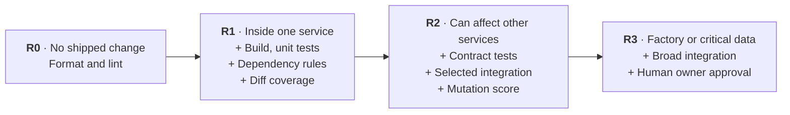

Some things raise a tier by one: an owner's protected path, weak test history, an agent above its trust level, or more than three owning teams.

Test-only changes are never R0: they run at least the changed project's own tests. A change that deletes tests, skips them or removes assertions needs the owning team's approval, because weakening tests can't be allowed through on lint alone.

**Merge priorities (P0 to P4)** set the order in the merge queue, not the evidence needed.

| Priority | Used for |
| --- | --- |
| P0 | Emergencies: hotfixes and pure reverts |
| P1 | Human interactive work |
| P2 | Release-critical agent work |
| P3 | Normal agent work |
| P4 | Maintenance and background work, such as promotion bumps |

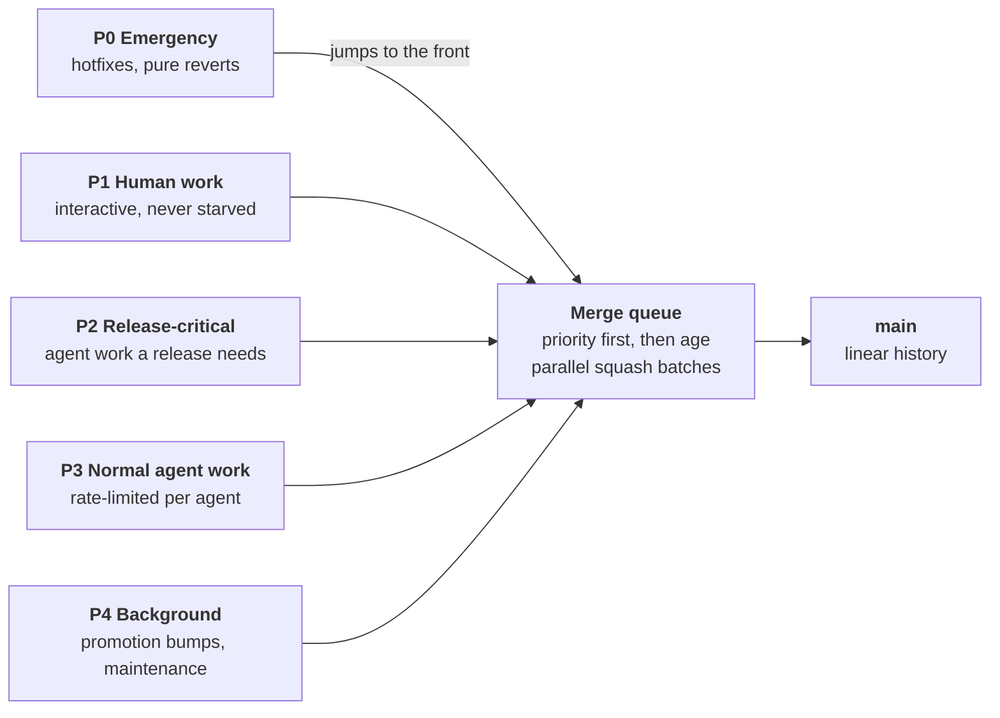

**Other terms:**

- **Boundary:** a top-level folder area a PR must stay inside, such as `product/` or one internal tool.
- **Gate:** the first CI step. It works out the boundary, risk tier, required evidence and approvers.
- **Evidence:** a signed record that a check ran on the exact commit, and its result.
- **Admission:** the single required check that compares the evidence present with what the tier requires, and allows or blocks the merge.
- **Trust level:** how much an agent may do without a human, from experimental through observed and trusted to autonomous.
- **Escape:** a defect caught later than the level where it was introduced.
- **Contract:** what a service or tool promises to others: its API, events, CLI, config and data schema.

## Repository structure

The repo has eight top-level boundaries. Every file belongs to exactly one, and the root workspace files belong to their own top-level Workspace boundary, separate from `ci/`.

```text
monorepo/
├── product/                  # Product boundary: everything that ships
│   ├── services/<service>/   # ~100 services, each with service.yaml + code
│   ├── frontend/<app>/
│   ├── libraries/<lib>/      # shared product code
│   └── tests/                # cross-service product tests (contract, integration)
│
├── internal-tools/           # one sub-boundary per internal tool
│   ├── toolchains/           # language plugins (typescript, go, python, rust, container)
│   └── <tool-x>/             # each tool changes alone
│
├── internal-services/        # one sub-boundary per internal service
│   └── <service-y>/          # service.yaml + code, same toolchains as product
│
├── ci/                       # CI / Software Factory boundary
│   ├── policy/               # boundaries, risk rules, evidence, agents, priorities
│   ├── factory/              # gate, risk, admission, provenance scripts + tests
│   └── catalog/              # generated CODEOWNERS and service catalog index
│
├── platform/                 # Platform boundary: runners, cache, registry config
├── test-framework/           # Shared test infrastructure
├── docs/                     # Docs boundary: the factory spec and guides
│
├── .github/                  # owned by ci/ (workflows, actions, rulesets, CODEOWNERS)
├── nx.json, package.json     # Workspace boundary (root files)
└── README.md
```

Each service keeps its own `service.yaml` with name, owners, toolchains, criticality and dependencies. That one file feeds the Nx project graph, CODEOWNERS and the catalog.

Each project owns its own lock file (`package-lock.json`, `go.sum`, `uv.lock` or `Cargo.lock`) inside its folder. The root holds only Nx's own dependencies, so adding a package to one service never touches the Workspace boundary.

## Boundary rules

A PR must stay inside one boundary, or the factory gate fails it before any build runs. The rules live in `ci/policy/boundaries.yaml`, so changing them is itself a `ci/` change.

| Boundary | Paths it owns | A PR in it may touch |
| --- | --- | --- |
| Product | `product/**` | Anything under `product/` (services, frontend, libraries, tests together) |
| Internal tool | `internal-tools/<tool>/**` | Only that one tool's folder |
| Internal service | `internal-services/<service>/**` | Only that one service's folder |
| CI / Factory | `ci/**`, `.github/**` | Only CI paths, nothing else |
| Workspace | Root files: nx.json, package.json and Nx's own lock file, .gitignore, tool version pins | Only root files |
| Platform | `platform/**` | Only `platform/` |
| Test framework | `test-framework/**` | Only `test-framework/` |
| Docs | `docs/**`, `README.md` | Only docs |

A PR that crosses boundaries is rejected with a message telling the author how to split it. The only exception is an explicit override label that a factory owner applies; the override is recorded in the evidence and forces risk tier R3, so it stays visible and attributable.

Crossing a boundary on purpose has its own rules:

- **Dependencies across boundaries** go only through published, versioned artifacts, never source paths. Product code uses `product/libraries` from source; a tool or internal service uses its released version.
- **API changes across boundaries** use expand and contract: ship the new API next to the old one, move each consumer in its own PR, then remove the old one. Contract tests keep the old API working until no consumer uses it.
- **Moving a project** between boundaries is one override-labelled PR that only moves files, at R3.
- **Override labels** count only when a factory owner added them. The gate checks who added the label from the label event.
- **Override rate** per team is tracked weekly and reviewed monthly. A rising rate means a boundary is drawn in the wrong place, and the fix is to redraw it.
- **Workspace changes** affect every project, so they run the full build in a scheduled off-peak window.

## Hard rules for services, tools and product

Product, internal services and internal tools all follow one set of invariants in `ci/policy/invariants.yaml`. The gate checks them on every PR, and most cannot be overridden by anyone.

### Who may depend on whom

Dependencies run in one direction, and across boundaries only through published contracts or versioned artifacts.

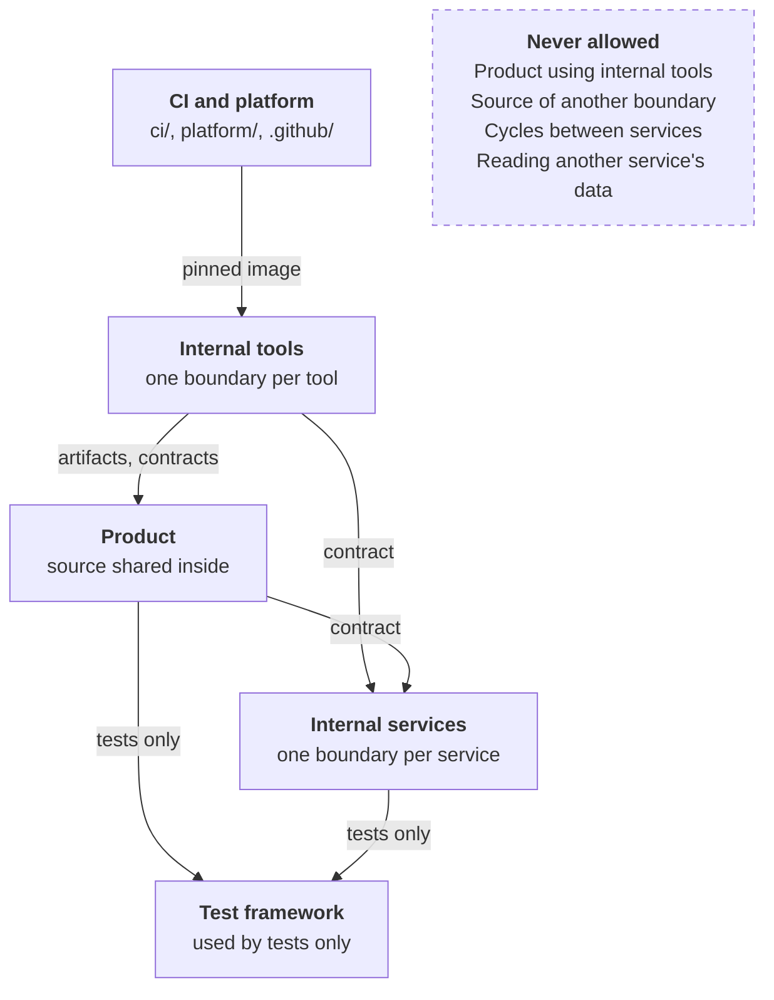

| From ↓ / To → | Product | Internal services | Internal tools | Test framework |
| --- | --- | --- | --- | --- |
| **Product** | Source inside `product/` | Published contract only, at runtime | Never | Tests only |
| **Internal services** | Published contract only | Published contract only | Never at runtime | Tests only |
| **Internal tools** | Published artifacts and contracts only, for example a simulator | Published contract only | Released version only | Tests only |
| **CI and platform** | No | No | Tool image pinned by digest | No |

The service graph must stay acyclic. A PR that adds a dependency cycle between services, at build time or at runtime through `consumes`, fails.

### Invariants

| Rule | Applies to | Enforced by | Overridable |
| --- | --- | --- | --- |
| Dependencies follow the table above | Everything | Gate check on the Nx project graph, using boundary tags from `service.yaml` | No |
| No dependency cycles between services | Product, internal services | Gate check on the project graph and the `consumes` graph | No |
| Every service and tool declares its contract: API, events, CLI flags, exit codes, output formats, config | Product, internal services, internal tools | Gate: a project without a declared contract can't release | No |
| A released contract is never broken within a major version, and the previous major stays supported until the catalog shows no consumer | Everything with a contract | Contract diff against released tags, plus consumer contracts | Owner approval of a major bump only |
| Deprecation before removal: an item is marked deprecated, consumers are notified, and it's removed only once the catalog shows no consumer | Everything with a contract | Gate refuses removal while consumers remain | No |
| Each service owns its data; no service reads or writes another service's storage | Product, internal services | Declared `data:` in `service.yaml`; config scan for foreign connection strings | No |
| Internal tools never ship inside product artifacts | Product | Artifact contents and SBOM scan at package time | No |
| Every project has `lint`, `test`, `build` and `package` targets, `service.yaml` and `guardrails.yaml` | Everything | Gate schema check | No |
| Tools run offline, in a container, are deterministic, and report their version | Internal tools | Toolchain template and gate check | No |
| Every artifact carries an SBOM and build provenance | Everything released | Release job refuses to publish without them | No |

### How the rules themselves change

The invariants are a `ci/` change at R3 that needs factory owner approval. Like all gate rules they are read from the base branch, so no PR is ever judged by rules it changes itself.

## Promoting shared tooling

A change to shared tooling reaches the CI image as a chain of small PRs, one boundary each, linked by published versions instead of source paths.

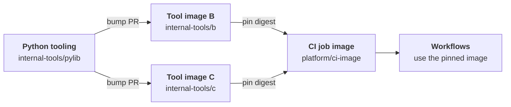

1. **Consume releases, not source.** Tool images B and C pin the Python tooling by version in their lock files. A change to the tooling never breaks B or C in the same PR, so failure stays inside its boundary.
2. **Declare who consumes what.** Each tool's `service.yaml` lists `consumes: [pylib]`. The catalog turns that into a downstream graph, so the factory knows B and C, then the CI image, must follow.
3. **A promotion bot opens the bump PRs.** When the tooling publishes, a registered automation account opens one bump PR per consumer, in graph order. Each PR runs that consumer's own tests and, on merge, publishes a new image digest.
4. **The CI image pins digests.** `platform/ci-image` pins B and C by digest, never by a moving tag. The bump PR that updates those pins is the promotion: a `platform/` change at R3, so a human approves it. Workflows reference only that one pinned CI image.
5. **Traceable and reversible.** Every bump PR carries a `Promotes: pylib@<version>` trailer, so the chain from the first change to the CI image is attributable. Rolling back is reverting the pin PR.

A candidate can be tried before promotion: a PR labelled `ci-image-canary` runs its workflows on the unpinned candidate image, without changing what everyone else uses.

### Escaped defects feed back to the lowest level

A defect caught later in the chain than where it was introduced is an escape, and the factory forces a test at the lowest level that could have caught it.

1. **Detect.** A downstream bump PR, the CI image canary, the merge queue or a post-release report fails. The `Promotes` trailers and evidence records trace the failure back to the PR that introduced it.
2. **Hold.** The origin component is put on hold: the promotion bot stops opening new bump PRs from it until the escape is closed.
3. **Open an escape issue.** The factory opens an issue on the origin component's owners, naming the failing check, the origin PR and the level where it was caught.
4. **Fix with a lower-level test.** The fix PR, labelled `escape-fix`, must add a test in the origin component. Admission runs that test against the parent commit and requires it to fail there and pass with the fix. Without that evidence the fix cannot merge.
5. **Release the hold.** Merging the fix closes the issue and lifts the hold, and promotion resumes.
6. **Count it.** Escapes per component, and per agent when an agent wrote the origin PR, go into the defect escape rate. For an agent, escapes lower its trust level under the earned-autonomy rules.

**Fix now, test after.** When it cannot wait, an owner labels the fix `hotfix`, which makes it P0 and lifts the hold for that one PR.

- **Fast:** the fix jumps the merge queue and merges without the regression-test evidence. Build, unit tests and the boundary check still run.
- **Recorded:** the override names who applied it and why, and is stored with the evidence, as the spec requires.
- **Not forgotten:** merging a hotfix opens the escape issue automatically, assigned to the origin's owners. The component stays on hold for normal promotion until a follow-up PR adds the missing lower-level test, proven to fail without the fix.
- **Visible:** open hotfix escapes and their age appear in the factory metrics, so test debt from emergencies cannot pile up quietly.

Owners can dispute an escape they think was traced to the wrong origin. A factory owner can lift the hold, and the lift is recorded.

## Language toolchains and service catalog

Adding a language means adding one folder under `internal-tools/toolchains/`; nothing in `ci/`, `nx.json` or any workflow changes.

Each toolchain folder holds a single `toolchain.yaml` that declares:

- **Detection:** which services use it (named in each service's `service.yaml`).
- **Targets:** the `lint`, `test`, `build` and `package` commands Nx runs for those services, with their cache inputs and outputs.
- **Setup:** the tool versions, pinned through `mise` for local work, and the toolchain image CI runs the targets in, pinned by digest.
- **Template:** a starter folder used when someone creates a new service.

One generic Nx plugin in `internal-tools/toolchains/` reads every `toolchain.yaml` and every `service.yaml` and builds the project graph from them. Product services and internal services use the same toolchains. A service can list more than one toolchain, for example `[go, container]`, so a Go service also gets an `image` target built with BuildKit.

- **Real dependencies are checked.** Each toolchain extracts the real dependency list (`go list`, Python imports, npm manifests), and the gate fails when it doesn't match `service.yaml`, so `nx affected` never skips a project it should test.
- **Toolchain changes are R3.** A toolchain version bump affects every service that uses it, so it runs on a canary set of services first, then on all of them.
- **Container builds reuse layers.** BuildKit keeps its layer cache in the internal registry, and base images are pinned by digest.

| Toolchain | Lint | Test | Package artifact |
| --- | --- | --- | --- |
| typescript | `tsc --noEmit` | `node --test` | npm tarball |
| go | `go vet` | `go test` | static binary tarball |
| python | `ruff` | `pytest` via `uv` | wheel |
| container | `hadolint` | image smoke test | OCI image built with `docker buildx` |
| rust | cargo clippy, cargo fmt --check | cargo test (nextest) | static binary tarball, or a crate in the internal registry for libraries |

The service catalog is the set of `service.yaml` files. Owners are read from them at admission time, and admission requires the approvals described under Ownership and contribution, so adding a service never touches `.github/`. `CODEOWNERS` stays coarse, one line per boundary, and the catalog index is built by CI, not committed.

### Pinned toolchain images

CI runs every toolchain target in a container image the repo builds itself, pinned by digest, so each job gets exactly the tools the last reviewed pin named and downloads no tools at run time.

| Image | Folder | Holds | Used by |
| --- | --- | --- | --- |
| `ci-lint` | `internal-tools/toolchains/lint-image/` | hadolint, shellcheck, actionlint | the container toolchain's `lint` |
| `ci-typescript` | `internal-tools/toolchains/typescript/image/` | Node 24 and npm | all TypeScript targets |
| `ci-go` | `internal-tools/toolchains/go/image/` | Go 1.25, gremlins, Node for the test report helper | all Go targets |
| `ci-python` | `internal-tools/toolchains/python/image/` | Python 3.13, uv | all Python targets |
| `ci-rust` | `internal-tools/toolchains/rust/image/` | Rust with rustfmt, clippy and llvm-tools, cargo-llvm-cov, cargo-mutants, Node for the report helper | all Rust targets |

- **Each image is a project.** Its folder holds a `Dockerfile`, a `service.yaml` with `toolchains: [container]` and a `container-test.sh` that checks the tool versions against the toolchain's `setup.mise`. A PR that changes an image builds and tests it with the same container toolchain as any service, so it uses the shared BuildKit service once that is configured. A new language still means one folder: its image lives inside it.
- **Base images are pinned by digest.** Every `FROM` names a tag and its digest; tools come from pinned upstream images or `go install`/`cargo install` at a fixed version.
- **Publishing.** On `main`, the `images` workflow builds each image whose folder changed with the project's `package` target and pushes it to `ghcr.io/<owner>/<repo>/<image>:<commit>`, writing the digest to the run summary.
- **Pinning is the promotion.** A toolchain's `toolchain.yaml` names its image by digest (`image:`, or per target). Moving a pin is a toolchains PR, R3 like any toolchain change, and re-tests every service on that toolchain before it merges. Rolling back is reverting the pin.
- **Running a target in its image.** When `FACTORY_TOOLCHAIN_IMAGES=true`, the Nx plugin runs a pinned target through `internal-tools/toolchains/in-image.sh`: `docker run` as the caller's user, with the workspace mounted at the same path so reports keep their paths, `FACTORY_*` and mirror variables passed through, and a per-image cache directory mounted as `HOME`. Unset, targets run on the host as before, so local work doesn't need Docker; set it to check a change exactly as CI does.
- **CI switches by one variable.** The verify and nightly jobs set `FACTORY_TOOLCHAIN_IMAGES=true`, log in to GHCR with the job token and drop `mise`. The release job does the same and keeps `mise` only for releasing commits from before the pins. Container builds stay on the runner's BuildKit: images are built by the container toolchain, not inside an image.
- **Public runners by default.** The images are on GHCR, which GitHub-hosted runners reach directly. Make the packages public once so developers can pull them without logging in.
- **Air-gapped, optional.** Mirror the pinned images into the internal registry and set `FACTORY_TOOLCHAIN_REGISTRY` to its host: `in-image.sh` swaps `ghcr.io` for it and keeps the digest, so the pins stay valid. Image builds then take base images through the internal registry. Off by default.
- **Not in the images.** Packages that projects fetch from a package index (npm, PyPI, crates, Go modules, and the mutation tools Stryker and mutmut) still come from the index or its internal mirror. The factory's own scripts keep running on the runner's Node until the Python factory settles its runtime.

Delivered as one PR per step, each linked to its issue:

1. This section (docs), [#137](https://github.com/Tiima-portfolio/monorepo_template_PaaS/issues/137).
2. The `images` workflow that publishes changed toolchain images to GHCR (CI), [#138](https://github.com/Tiima-portfolio/monorepo_template_PaaS/issues/138).
3. One PR per image (toolchains): `ci-lint` [#139](https://github.com/Tiima-portfolio/monorepo_template_PaaS/issues/139), `ci-typescript` [#140](https://github.com/Tiima-portfolio/monorepo_template_PaaS/issues/140), `ci-go` [#141](https://github.com/Tiima-portfolio/monorepo_template_PaaS/issues/141), `ci-python` [#142](https://github.com/Tiima-portfolio/monorepo_template_PaaS/issues/142), `ci-rust` [#143](https://github.com/Tiima-portfolio/monorepo_template_PaaS/issues/143).
4. `in-image.sh`, the plugin's `image:` support and the first digest pins (toolchains), [#144](https://github.com/Tiima-portfolio/monorepo_template_PaaS/issues/144).
5. Verify, nightly and release jobs run the toolchains in the pinned images (CI), [#145](https://github.com/Tiima-portfolio/monorepo_template_PaaS/issues/145).

## Ownership and contribution

The team that owns a service is accountable for it, but it is often not the team or agent writing the change, so the factory tracks four roles separately on every PR.

| Role | Who | Responsible for | Where it's recorded |
| --- | --- | --- | --- |
| Owner | One team per service | The service's contract, quality thresholds and health; approves contract changes and high-risk changes | `owner:` in `service.yaml` |
| Contributor | Any team, or an agent acting for a team | Writing the change, keeping it green, fixing escapes it caused | The PR author, or the agent's sponsoring team in `agents.yaml` |
| Requester | The human who asked for the change | The intent: that the change does what was wanted | `Requested-By` trailer, required on agent PRs |
| Approver | A human who is neither the author nor the requester | Independent judgement on the change | The PR review |

**A feature can span services.** Inside `product/`, one PR may change several services together, so a feature team can ship a coherent change in one squash commit. Every PR carries a `Feature-Id` trailer, so lead time and escapes are reported per feature as well as per service.

**Who must approve depends on what changed, not just where.**

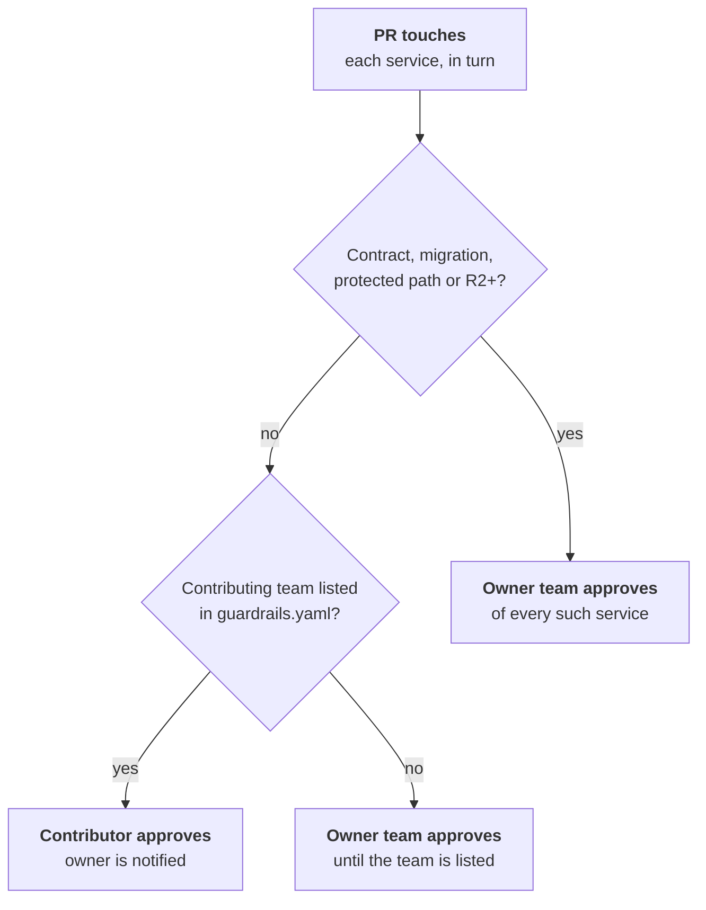

- **Internal change, R0 or R1:** a human from the contributing team may approve, if that team is listed under `contributors:` in each touched service's `guardrails.yaml`. The owner is notified in the PR comment but isn't blocking.
- **Contract change, data migration, security-sensitive paths, or R2 and above:** a human from the owning team of each affected service must approve.
- **Contributor not listed:** the owner must approve, whatever the tier. Owners grow their contributor list as trust builds, the same way agents earn autonomy.
- **Too many owners:** a PR that needs approval from more than three owning teams is R3, and the gate suggests splitting it by service with the same `Feature-Id`.

**New services and owner changes.** The base branch can't name an owner for a service that doesn't exist yet, so the first PR could otherwise pick its own approvers.

- **Creating a service or tool:** approved by a catalog approver for that area, listed in `ci/policy/catalog-approvers.yaml`, as well as by the team named as owner.
- **Changing a service's owner:** approved by both the current owner, read from the base branch, and the new owner.
- **Removing a service:** approved by its current owner, and the gate refuses while the catalog still shows consumers.

**Agents act for a team.** Each agent in `agents.yaml` has a sponsoring team. An agent's PR gets that team's contributor rights, capped by the agent's own trust level, and a human from the sponsoring team or the owner approves it, never the requester alone.

**Routing is automatic.** The gate works out the required approvers per touched service and lists them in its PR comment, so nobody has to know who owns what.

**Escapes land on both sides.** An escape counts against the contributor (team or agent) who wrote the change and against the owning service's test-adequacy record. The fix goes to the contributor; the missing test goes to the owner, who decides where it belongs.

### Owner-defined guardrails

Each owning team sets its own guardrails for its service in one file it controls, and the pipeline enforces them on every contributor, human or agent, with no help from the CI/platform team.

The file is `guardrails.yaml` in the service folder:

```yaml
# product/services/orders/guardrails.yaml (owned by team-orders)
protected_paths:            # owner approval + one tier up when touched
  - migrations/**
  - src/payments/**
required_checks:            # owner's own Nx targets, run when paths match
  - target: simulate-checkout
    when: [src/**, api/**]
  - target: perf-benchmark
    when: [src/pricing/**]
    budget: 5m
thresholds:                 # may only be stricter than the factory floor
  diff_coverage: 90
  mutation_score: 80
agents:
  max_autonomous_tier: R0   # agents need a human above this tier here
  forbidden_paths: [src/payments/**]
contributors: [team-checkout, team-search]
```

How the pipeline enforces it:

- **Read from the base branch.** The gate reads `guardrails.yaml` from the base branch, like its own code, so a PR can't loosen the guardrails it is judged by.
- **Only the owner changes it.** A PR that edits `guardrails.yaml` needs the owning team's approval, whoever wrote it.
- **Floors can't be lowered.** The factory sets minimums in `ci/policy/`. A schema check fails any `guardrails.yaml` that is looser than a floor, so owners can only tighten.
- **Owner checks are evidence.** Each `required_checks` target becomes required evidence when its paths change, runs within its own time budget, and is recorded like any other check.
- **Same locally.** `npm run check` runs the owner's checks too, so contributors see a guardrail fail before they push.
- **Visible on the PR.** The gate's PR comment lists which guardrails the change triggered and which checks and approvals they added.
- **Template ready.** The new-service generator writes a `guardrails.yaml` with sensible defaults, so every service starts with guardrails rather than an empty file.

## Pipeline flow

Every PR, from a human or an agent, runs the same pipeline, and the single required status check is the admission decision.

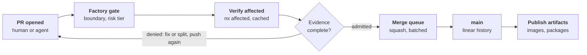

The merge queue re-runs verification on the batched result before it lands, so `main` only ever receives a squashed commit that passed on top of the latest `main`.

Two rules keep the pipeline honest:

- **The gate judges from the base branch.** The gate and admission code always run from the base branch, never from the PR head. A PR that changes them is judged by the current rules, and its changes apply only after it merges.
- **Only trusted builds write the cache.** PR builds and merge queue builds read the remote cache but never write to it, because both run build scripts the PR may have changed. Only builds of commits already on `main` write, using write credentials that only the `main` runner pool holds, so one bad PR cannot plant wrong results.

- **Rule changes merge alone.** A PR that changes the gate, admission, `ci/policy/` or any owner's `guardrails.yaml` is never batched with other PRs: the queue controller lets the queue drain, merges it on its own, and then re-runs the gate and admission for every PR still waiting, under the new rules, before any of them enters the queue.

Factory automation runs as one GitHub App. It keeps a single comment per PR up to date instead of posting new ones, and queues and batches its API calls to stay under GitHub's rate limits.

The evidence each tier requires is listed under [Terms used in this plan](#terms-used-in-this-plan).

The tier is computed from paths, the number of affected projects and each service's criticality in `service.yaml`. Rules live in `ci/policy/risk.yaml` and `ci/policy/evidence.yaml`. Every check writes an evidence record tied to the exact commit SHA, and admission compares those records with what the tier requires.

We don't control which versions run together, so contract tests check each service against the released N and N-1 versions of every service it talks to, and data migrations must work with N-1.

Merge queue priority follows the spec's P0 to P4 labels. GitHub's queue only supports jumping to the front, so P0 uses that and the rest map to queue order and agent rate limits.

At 1000 PRs a day, about 42 an hour, a single 15-minute batch would need about 11 PRs every time. So the queue builds several batches in parallel, sizes each batch from the live queue depth, bisects a failed batch to eject only the culprit, and keeps quarantined flaky tests out of its required checks.

A pure revert of one merged PR is verified mechanically and takes the P0 lane.

On every push to `main`, the release workflow packages only the projects that commit affected. It publishes container images to the registry and packages to GitHub Releases, tagged `<service>/<version>`, each with an SBOM and build provenance.

### Keeping the merge queue running

The merge queue is the one place every change passes through, so it's run as a production service: it has its own capacity, its own targets, an on-call owner, and a defined way to fail without stopping.

| What could stop the queue | How the queue keeps moving |
| --- | --- |
| A bad PR breaks a batch | The batch is bisected and only the culprit is ejected; the rest merge |
| A bad commit reaches `main` anyway | A post-merge check on `main` finds it; the factory opens and fast-tracks a pure revert as P0, and the queue keeps running |
| Flaky tests | Retry once; quarantine only after 20 reruns confirm the flake, for at most 5 working days; quarantined tests still block if they fail three runs in a row |
| Not enough runners | A dedicated runner pool serves only the merge queue and `main`, with a warm minimum that never scales to zero, so PR load can't starve it |
| Too many PRs at once | Backpressure: when queue depth passes its limit, P4 and then P3 stop entering; P0 to P2 keep flowing |
| Remote cache down | Builds fall back to running without the cache: slower, but not stuck |
| Evidence store down | Admission decides from the verified in-flight records; the collector buffers and writes the bundle when the store is back, and alerts if it can't |
| Internal mirror down | Queue runners use pre-pulled base images and a warm local package cache |
| A gate or policy change blocks everything | Gate changes run in shadow mode on live PRs before they enforce, and a bad gate change is reverted like any other commit |
| GitHub itself is down | The queue pauses and resumes when GitHub returns; nothing can merge meanwhile, by design |
| Queue settings lost or changed | The queue and branch rules live in the repository ruleset file and are re-applied from it; manual changes are detected and reverted |

**Targets and ownership.** The queue has service levels the CI/platform team owns: p90 time from entering the queue to merged under 30 minutes, at most 1% of batches failing for non-PR reasons, and `main` red for no more than 15 minutes at a time. A factory on-call rotation is paged when any of them is breached.

**Visible to everyone.** A dashboard shows queue depth per priority, wait time, batch failure reasons, ejections and runner usage, fed from the evidence index.

**Break-glass.** If the queue itself is broken, a factory owner can merge one P0 change directly. That bypass is recorded as an override with its reason, and the factory opens an incident to fix the queue.

**How it's built.** Three pieces do the work: GitHub's own merge queue, configured from the ruleset file; a queue controller that is part of the factory GitHub App; and separate runner pools in `platform/`.

| Protection | Mechanism |
| --- | --- |
| Squash batches, run in parallel | GitHub merge queue in the `main` ruleset: merge method squash, grouping "all green", up to N entries built at once, a check timeout matching the hard limits. Workflows run on the `merge_group` event |
| Ejecting only the culprit | GitHub builds each queue entry together with everything ahead of it. When an entry fails, GitHub removes that PR and rebuilds the entries behind it without it |
| P0 to P4 order and backpressure | GitHub's queue has no priorities, only "jump to the front". So a PR that passes admission isn't added to GitHub's queue directly: the queue controller holds it in its own priority list and enqueues by priority, then age, only while GitHub's queue is below its depth limit. P0 uses the API's jump option |
| Auto-revert on a red `main` | A workflow on every push to `main` re-runs the affected checks. On failure the factory App creates a `git revert` PR of that squash commit, labels it P0 and enqueues it with jump |
| Flaky test quarantine | Each toolchain's test wrapper retries a failed test once and reports both results. The collector schedules 20 reruns for a pass-after-fail test and marks it quarantined in the evidence index only if they both pass and fail, and the wrapper fetches that list at run time, so quarantined tests still run and report but can't fail the queue |
| Dedicated, warm runners | Actions Runner Controller on the platform Kubernetes cluster runs separate ephemeral runner scale sets: `queue` for `merge_group` and `main` jobs with a minimum number always running, and `pr` for PR jobs. Workflows choose them by runner label |
| Cache and mirror outages | The Nx remote cache client has a short timeout and falls back to a local build on error. Queue runner images come with base images and package caches pre-loaded |
| Evidence store outage | Admission reads the verified records straight from the run's Actions artifacts. The collector writes to the bucket with retries and alerts after its retry budget runs out |
| Shadow mode for gate changes | Every rule in `ci/policy/` has `mode: shadow` or `mode: enforce`. A shadow rule runs and records its result as evidence but never blocks; it moves to enforce in a later PR once its shadow results show no false blocks |
| Ruleset drift | A scheduled factory job compares the live rulesets from the GitHub API with the ruleset file, re-applies the file with the App's token, and alerts on any difference |
| Targets and paging | The collector and GitHub webhooks feed queue events into the platform metrics stack; alert rules on the three targets page the factory on-call |
| Break-glass | Only a small break-glass team is on the ruleset's bypass list. A push workflow flags any commit on `main` that has no merge queue evidence, records it as an override and opens an incident |

### Where evidence lives

Evidence is written once as signed records tied to the exact commit, kept in a write-once bucket inside the network, and indexed in a database for queries. GitHub shows the summary.

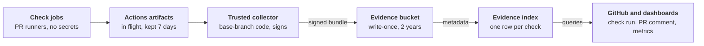

| Layer | Store | Holds | Kept for | Written by |
| --- | --- | --- | --- | --- |
| In flight | GitHub Actions artifacts | One JSON record per check, passed from the check jobs to admission | 7 days | Each check job |
| System of record | Evidence bucket: S3-compatible, write-once with object lock, separate from the cache | The signed evidence bundle per commit: every check, its result, duration, tool versions, actor, agent provenance, approvals and overrides | 2 years, set in `ci/policy/` | The trusted collector only |
| Index | Evidence database (PostgreSQL in `platform/`) | One row per check and per decision, pointing at the bundle | As long as the bundle | The trusted collector |
| Summary | GitHub check run `factory/admission` and the gate's PR comment | Decision, tier, required versus present evidence, link to the bundle | As GitHub keeps PRs | Admission |
| Release | GitHub artifact attestations on each image and package digest, plus a copy in the bucket | SBOM, build provenance, and the evidence bundle of the commit it was built from | As long as the artifact | Release job |

How it stays trustworthy:

- **Records use one format.** Each record is an in-toto attestation whose subject is the commit SHA and its git tree hash, with the check name, result, tool versions and timing as the payload.
- **The trusted workflows can't be changed by a PR.** The gate, admission and collector are ruleset-required workflows, pinned to the workflow files on the default branch. A PR that edits them doesn't change what judges it.
- **Pass or fail comes from GitHub, not the record.** PR runners have no secrets and only hand records over as Actions artifacts. The collector doesn't trust a record's own result: for each record it reads the job's conclusion, workflow file path and ref, run ID and the commit SHA it checked out from the GitHub API, and accepts the record only when all of them match the required check. Measurements in the record, such as coverage, are kept only from those verified jobs.
- **Signed by the factory, after verification.** The collector, running base-branch code, signs the bundle with the factory App's key and writes it to the bucket and index.
- **Merge queue evidence carries over only when proven.** A merge queue build runs on a temporary commit, not the squash commit that lands on `main`. After the merge, the collector compares the git tree of the new `main` commit with the tree of the merge queue commit the evidence was recorded on. Only an exact match links the evidence to `main` and the release; any mismatch makes the post-merge check on `main` run the full required set again.
- **Nothing is edited.** Object lock means a bundle can't be changed or deleted before it expires; an override or a later escape is a new record that points at the old one.
- **One source for every report.** Metrics, test adequacy, agent trust, escape trace-back and feature lead time are all queries on the index, so every number traces back to a signed record.

### Versions come from git tags

`service.yaml` holds what a team decides: owners, toolchains, criticality, dependencies. The version is release state, so it lives in git tags instead.

- **Tag format:** `<service>/v<semver>`, for example `orders/v1.4.2`, on the squash commit that was released.
- **Bump level:** the PR title uses conventional prefixes (`fix:` patch, `feat:` minor, `feat!:` major). The gate checks the title against the contract diff, as set out below.
- **Who tags:** only the release job's GitHub App may create these tags; a ruleset blocks everyone else and makes tags immutable.
- **Order:** releases follow the order of `main`, not the order jobs happen to start. A single release controller keeps a cursor at the last released commit and, on each run, walks every newer `main` commit in history order. A run that is cancelled or starts late loses nothing, because the next run picks up from the cursor.
- **Changelog:** generated from the squash commit titles that touched the service since its previous tag; linear history makes that list exact.
- **Clone cost:** with about 100 services releasing often, tags reach tens of thousands. CI fetches without tags and pulls only the one service's latest tag it needs.

The release is a pair: the artifact is published first, under its immutable digest, and the tag is created only after it. On every run the controller reconciles pairs: a tag without its artifact is rebuilt and republished from the tagged commit, and an artifact without its tag gets the tag. A commit on `main` that stays unpublished raises an alert.

### Choosing major, minor or patch

The machine decides the minimum bump from the contract diff, and the PR title must agree with it; people can raise a bump but never lower it.

| Level | What counts | Examples | Extra rule |
| --- | --- | --- | --- |
| Major | A change that can break a consumer of the public contract | Removed or renamed endpoint, field or function; changed type; stricter validation; removed config or environment variable; data migration that doesn't work with N-1 | Title needs `!`, the change is R3, owners of consuming services are notified |
| Minor | A backward-compatible new capability | New endpoint, optional field, function or event; new config with a safe default | None |
| Patch | Shipped behaviour changes, contract doesn't | Bug fix, performance, internal refactor, dependency or base image update | None |
| No release | Nothing shipped changes | Tests, docs, comments, the service README | Prefixes `test:`, `docs:`, `chore:` create no tag |

**What the public contract is.** Each service declares it in `service.yaml`: its OpenAPI or protobuf files, its exported package API, its events, config and environment variables, and its data schema.

**How the bump is set.**

1. The gate diffs the contract against the last released tag with each toolchain's checker: OpenAPI and protobuf diff tools, the Go API diff, the TypeScript public API report, and the Python signature check.
2. That gives a minimum level for every affected service: major for a breaking diff, minor for an addition, patch for any other change to shipped code.
3. The PR title prefix (`fix:`, `feat:`, `feat!:`) must be at least the highest minimum among the services it changes. A lower title fails the gate, with a message naming the breaking or added items.
4. Each service is released at its own detected level, raised to the title's level when the title is higher. So one product PR can release `orders` as minor and `billing` as patch.

**When it happens.** The release job computes and tags versions on merge to `main`, one release per squash commit per affected service. There are no pre-release versions on `main`.

**Rebuild-only releases.** When only a dependency, toolchain or base image changed, consumers that the promotion bot rebuilds get a patch release.

**Before 1.0.** New services start at `0.1.0`. While below 1.0, a breaking change is a minor bump. A service moves to `1.0.0` when another service first consumes it, and from then on breaking means major.

Git notes were considered and rejected. GitHub doesn't show them, they aren't fetched by default, and all notes share one ref, so hundreds of concurrent writers would collide on it.

## Build and test time budgets

Every stage has a time budget in `ci/policy/budgets.yaml`. A job that exceeds its hard limit fails, and a project that drifts over budget gets an issue on its owners. The numbers below are proposed starting points to tune with real data.

| Stage | Budget (p90) | Hard limit, job fails |
| --- | --- | --- |
| Factory gate (boundary, risk, provenance) | 1 min | 3 min |
| Build, one project | 5 min | 10 min |
| Unit tests, one project | 3 min | 5 min |
| Contract tests, one project | 5 min | 10 min |
| Integration tests, selected | 15 min | 30 min |
| PR feedback, R1, end to end | 10 min | 20 min |
| PR feedback, R2, end to end | 20 min | 40 min |
| Merge queue batch | 15 min | 30 min |

How the budgets hold:

- **Tests have levels.** Unit tests use no network, containers or sleeps, and run in every PR. Slower tests are tagged `contract` or `integration` and run only from R2 up. The toolchain enforces the tags, so a slow test cannot hide in the unit suite.
- **Drift is an issue, not a surprise.** Each target's duration is stored with the evidence. When a project's 7-day p90 passes its budget, the factory opens an issue on its owners, like an escape, to split the project or move tests to the right level.
- **The cache must earn its keep.** The target is at least 80% remote cache hits on PR builds. A drop below that alerts the CI/platform team, since a missed cache usually means unstable inputs.
- **Flaky tests are quarantined.** A test is quarantined only after the factory confirms it is flaky: it reruns the test 20 times on the same commit, and it must both pass and fail. A test that fails every time is a real failure, not a flake. It stops blocking merges, an issue opens on its owners, and it must be fixed or removed within 5 working days.
- **Agents get the same budgets.** An agent PR that blows a hard limit fails like any other.

**How quarantine works.** No PR is needed. The factory handles it end to end:

1. **Detect.** The test runner retries a failed test once on the same commit. If the test passes on the retry, the CI job reports it as possibly flaky, and the factory confirms it with 20 reruns on that commit before anything is quarantined.
2. **Quarantine.** The factory adds the test ID to a quarantine list that it stores outside the repo. Every CI job reads that list when it starts.
3. **Keep running.** Quarantined tests still run, but their results are recorded and don't block merges. The factory opens an issue for the service owners through the GitHub API.
4. **Release or escalate.** A test leaves quarantine once its fix passes 20 repeated runs. If 5 working days pass without a fix, the factory marks the issue overdue and the quarantine expires, so the test blocks merges again. Who follows up, and how, is up to the owning team's way of working, not CI. The test must still be fixed or removed.

Three more rules keep the budgets fair:

- **Cold cache gets headroom.** Hard limits apply to warm-cache runs. A run flagged cache-cold, such as the first after a toolchain bump, gets double the limit.
- **Flake handling ships with the first merge queue.** A failed test is retried once; quarantine needs the 20-rerun confirmation, never a single pass.
- **Quarantine has limits.** Quarantined tests still run and report, each service has a quarantine cap, and time in quarantine counts in its metrics. While any of a service's tests is quarantined, that service's PRs are one tier up and the quarantined test runs three times on each of them: if it fails all three, the PR is blocked. Quarantine lasts at most 5 working days.

## Knowing the tests are enough

A green test run proves nothing if the tests are weak, so the factory measures test strength per change and per service, and weak tests raise the risk tier instead of passing quietly.

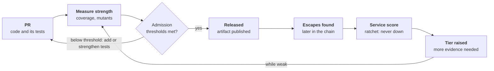

| Signal | What it shows | Rule |
| --- | --- | --- |
| Diff coverage | Changed lines that unit tests execute | At least 80% of changed executable lines covered, for every `fix:` and `feat:` PR. Measured on the diff, not the whole service, so legacy code doesn't block new work |
| Mutation score on the diff | Whether the tests would catch a wrong change, not just run the code | From R2 up, the toolchain's mutation tool (Stryker, a Go mutation tester, mutmut, cargo-mutants) mutates the changed code; at least 70% of mutants must be killed |
| Contract coverage | Whether every declared contract item is tested | Every operation, field and event in the service's declared contract has at least one contract test. An untested contract item fails the gate |
| Consumer contracts | Whether the provider is tested for what consumers really use | Consumers publish the contract they rely on into the repo; the provider must pass every consumer's contract before it merges |
| Dependency edge coverage | Whether every service-to-service link is tested | Each `consumes` edge in the catalog has at least one contract or integration test. A new edge without one fails the gate |
| Test quality lint | Tests that can't fail | Tests without assertions, skipped tests and snapshot-only tests on logic are flagged and fail the gate |
| Escape rate | Whether real defects get past the tests | Every escape is traced to the lowest level that should have caught it (see escaped defects) |

How it's enforced:

- **Ratchet, never decline.** Each service's diff coverage, mutation score and contract coverage trend is stored. A PR that lowers a service's level fails, so quality can only hold or rise.
- **Weak tests raise the risk tier.** A service whose 30-day escape rate or mutation score is below its policy threshold has every PR raised one tier, for example R1 to R2, until it recovers. Weak tests cost more evidence and more human review, not a silent pass.
- **Thresholds follow criticality.** `ci/policy/test-adequacy.yaml` sets thresholds per criticality level, and critical services get higher ones.
- **Agents can't grade their own homework.** An agent PR that adds both code and its tests needs the mutation score from R1 up, not R2, because tests written alongside the code tend to mirror it rather than challenge it.
- **Nightly full runs.** A full mutation run per service runs off-peak, so the per-PR diff runs stay inside the time budgets while the trend stays honest.
- **One dashboard.** Each service shows diff coverage, mutation score, contract coverage, escape rate and flake rate in the catalog, so owners see their gaps before the factory raises their tier.

**How nightly runs work.** A scheduled factory job runs these, not a PR. They report results but never block merges.

1. **When.** The run starts off-peak, from 01:00 UTC, against the latest commit on `main`. A service that hasn't changed since its last nightly run is skipped.
2. **What.** Each service gets a full mutation run over all of its code, plus its full contract and integration suites. The work is split into shards so each service finishes within 2 hours.
3. **Where results go.** Scores are written to the evidence store as that service's trend. That trend feeds the dashboard, the ratchet and the tier raise.
4. **On a drop or failure.** If a score falls below the threshold in `ci/policy/test-adequacy.yaml`, or a suite fails, the factory opens an issue for the owners. That service's next PRs move up one tier until it recovers.

## Agent guardrails

Agents use the same pipeline as humans; the gate adds two checks for agent PRs: provenance and trust level.

- **Registry:** `ci/policy/agents.yaml` lists each agent identity (its GitHub bot or app account), its trust level, the boundaries it may touch and the highest risk tier it may merge alone.
- **Provenance:** an agent PR must carry commit trailers `Agent-Id`, `Agent-Model`, `Agent-Task` and `Requested-By`. The gate fails a PR from a registered agent account that lacks them, and records them in the evidence bundle.
- **Earned autonomy:** trust levels follow the spec, from experimental to autonomous.

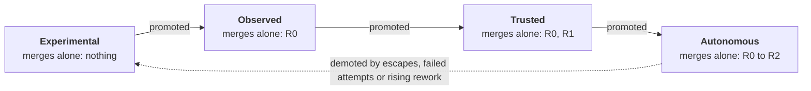

| Trust level | May merge without a human | Always needs a human |
| --- | --- | --- |
| Experimental | Nothing | Every PR |
| Observed | R0 | R1 and above |
| Trusted | R0 and R1 | R2 and above |
| Autonomous | R0 to R2 | R3 |

- **Rate limits:** each agent has a cap on open PRs and on queue entries per hour, so 300 agents cannot crowd out human P1 work.

- **Check before push.** Agents must pass `npm run check` in their own sandbox before pushing. Draft PRs run only the gate, and a new push cancels the run it replaces, so CI is never an agent's test loop.
- **Backpressure on review.** Each agent's open PRs are capped by the review capacity of the owners it needs. Humans get a daily review budget, and agents wait instead of piling up.
- **Starting trust by change type.** Docs-only and test-only changes start at observed trust, so a new agent is useful without a human on every PR.
- **Identity comes from the account.** Agent identity is the GitHub account or App that pushed, never the trailers, which only add context. A human running an agent locally labels the PR agent-assisted, and it counts toward that human's record.
- **No self-promotion.** Agents may never change `ci/policy/` or `.github/`, whatever their trust level.
- **Independent approval.** A required approval comes from a human owner who is neither the author nor the `Requested-By` person.

Promoting an agent is a PR to `agents.yaml`, which is a `ci/` change at R3, so it needs a factory owner's approval.

## Developer self-service

A dev team only ever touches its own service folder; the CI/platform team owns every tool, workflow, runner and policy behind it.

| What a dev team does | How |
| --- | --- |
| Create a service | One command, `npx nx g new-service --name=orders --lang=go`, which copies the toolchain template and writes `service.yaml` |
| Configure it | Edit `service.yaml` only: owners, toolchains, criticality, dependencies. No workflow or CI file in any service folder |
| Check before pushing | `npm run check` runs the same lint, test and build as CI for every toolchain (TypeScript, Go, Python and containers), for affected projects only. It calls Nx, which runs each toolchain's own commands, so a Go or Python team needs no npm knowledge |
| Understand a result | The gate posts one PR comment: boundary, risk tier, required evidence, what ran and what failed, with the next step to fix it |
| Release | Start the PR title with `fix:`, `feat:` or `feat!:`; the version and publishing happen on merge |

The CI/platform team owns `ci/`, `.github/`, `platform/`, `internal-tools/toolchains/` and the Workspace files. A dev team never needs to read them to ship.

Every other internal tool and internal service is owned by the team that builds it, as named in its `service.yaml`. A product team that needs product knowledge for a tool, such as a simulator or a test-data generator, owns that tool under `internal-tools/` or `internal-services/` and gets the same self-service as for its product services. The CI/platform team owns only the shared toolchains, not every internal tool.

## Air-gapped environment

The skeleton assumes no direct internet access from developer machines or CI; GitHub is the only outside service it uses.

- **Runners:** self-hosted GitHub Actions runners inside the network, so builds never leave it.
- **Dependencies:** npm, Go modules, PyPI and container base images come only through an internal mirror. Each toolchain's `toolchain.yaml` points at that mirror, never at the public registries.
- **Tool versions:** Node, Go, Python, `uv` and the linters come in the pinned toolchain images, mirrored into the internal registry (`FACTORY_TOOLCHAIN_REGISTRY`); BuildKit comes from the mirror. Nothing is downloaded by `mise` at run time.
- **Cache:** the Nx remote cache is a self-hosted bucket inside the network.
- **Artifacts:** published to GitHub (container registry and Releases) only.
- **GitHub Actions:** only actions vendored into this repo or into an approved GitHub organisation, pinned by commit SHA; no marketplace action that downloads at run time.
- **Check:** CI fails a change that adds a URL to a public package registry in toolchain or lock files.

- **Runners are ephemeral.** Each job gets a fresh runner. PR and merge queue runners hold no secrets; only `main` runners can publish or write the cache.
- **New packages are self-service.** A developer requests a missing package, security approves it, the mirror syncs, and the waiting PR re-runs on its own.
- **Security fixes are fast.** The mirror syncs on a schedule with a fast lane for security fixes, and the dependency update bot runs inside the network against the mirror.
- **Clones are partial.** CI uses partial clones deep enough to find the merge base, with a git cache on the runners, so 300 agents don't saturate GitHub.

## Shared BuildKit service

Container images are built by BuildKit. By default each runner uses its own local BuildKit, which is what public GitHub-hosted runners have. At 100 services and 300 agents, an internal BuildKit service gives every build the same pinned BuildKit, a warm layer cache and base images from the internal registry, and moves the build work off the runners. Runners still need Docker to run each image's smoke test.

The service is `internal-services/buildkit`: a rootless `buildkitd` image released like any other service image, and Kustomize manifests the CI/platform team applies with its own tooling. We deliver it as an artifact plus deployable manifests; the factory never applies them.

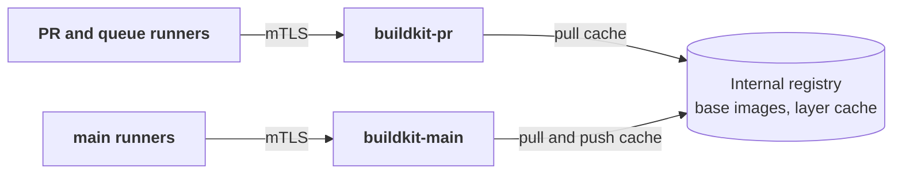

- **Two instances, never shared.** `buildkit-pr` serves PR and merge queue builds; `buildkit-main` serves only `main`. A PR's build steps run inside its daemon, so a daemon that built PR code is never trusted to build a release. This mirrors the Nx cache's read-only and read-write tokens.
- **Only `main` writes the cache.** Registry credentials come from the client, not the daemon, so PR runners, which hold no push credentials, can read the layer cache but never write it.
- **Switched by config, off by default.** The container toolchain uses the service when `FACTORY_BUILDKIT_ADDR` is set and the local BuildKit otherwise. Runner pods set it in `platform/runners/`; repository variables and secrets set it for GitHub-hosted runners.
- **Down means slower, not stuck.** If the service is configured but doesn't answer, the build warns and falls back to the local BuildKit, like the Nx cache.
- **mTLS only.** Clients present a certificate from the service's own CA; the daemon listens on nothing else, and a NetworkPolicy admits only runner pods.

| Step | Boundary | Issue |
| --- | --- | --- |
| This section | Docs | #127, #136 |
| Service image and smoke test | Internal service | #128 |
| Deployable manifests | Internal service | #129 |
| Container toolchain switches by config | Internal tool | #130 |
| CI jobs pass the settings | CI | #131 |
| Runner pools point at the service | Platform | #132 |

## Example internal service: the radiator

The radiator is a small internal dashboard that shows the factory's state on a screen: build status per service, merge queue depth and recent releases. It exists to show a complete service going through the factory: a backend, a frontend, container images, a Helm chart and a deploy on every PR. Its data is mock data for now.

It lives in `internal-services/radiator/`, one sub-boundary, as three projects:

| Project | Folder | Toolchains | What it is |
| --- | --- | --- | --- |
| `radiator-api` | `api/` | `[python, container]` | FastAPI app serving the data under `/api`, in a non-root image with its locked dependencies |
| `radiator-web` | `web/` | `[typescript, container]` | The dashboard page in plain TypeScript, compiled by `tsc` and served by a non-root nginx image |
| `radiator` | `chart/` | `[helm]` | The Helm chart: both Deployments and Services, and an Ingress sending `/api` to the API and the rest to the web image |

The chart depends on both images in `service.yaml`, so a change to either one re-renders and re-deploys the chart.

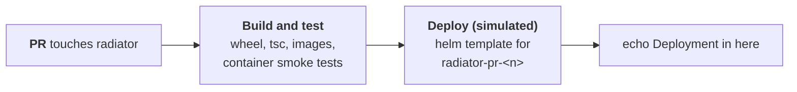

**A simulated PR deploy changes the earlier "no deploy stage" decision.** There is no cluster, so the deploy stops after rendering:

- **A `helm` toolchain.** `internal-tools/toolchains/helm/` adds `lint` (`helm lint`), `test` (the chart renders), `package` (`helm package`, released like any other artifact) and `deploy`. Like every toolchain it runs in its own pinned image, `ci-helm`.
- **`deploy` renders, then echoes.** It runs `helm template` for the namespace `<chart>-pr-<PR number>` with the PR's commit as the image tag, keeps the manifests in `dist/`, and prints `Deployment in here` where `helm upgrade --install` would go. Swapping that line for a real install is the only change a real cluster needs.
- **Only on PRs.** The verify job runs `nx affected -t deploy` on pull requests, after build and tests. The merge queue and `main` skip it: a PR preview is the only environment.
- **Optional.** A project opts in by listing `helm` in its toolchains. Projects without a chart are unaffected.

Delivered as one PR per step, each linked to its issue:

| Step | Boundary | Issue |
| --- | --- | --- |
| This section | Docs | [#180](https://github.com/Tiima-portfolio/monorepo_template_PaaS/issues/180) |
| `ci-helm` toolchain image | Internal tool | [#181](https://github.com/Tiima-portfolio/monorepo_template_PaaS/issues/181) |
| `helm` toolchain with the simulated `deploy` | Internal tool | [#182](https://github.com/Tiima-portfolio/monorepo_template_PaaS/issues/182) |
| `radiator-api` backend | Internal service | [#183](https://github.com/Tiima-portfolio/monorepo_template_PaaS/issues/183) |
| `radiator-web` frontend | Internal service | [#184](https://github.com/Tiima-portfolio/monorepo_template_PaaS/issues/184) |
| Helm chart | Internal service | [#185](https://github.com/Tiima-portfolio/monorepo_template_PaaS/issues/185) |
| PRs run the simulated deploy | CI | [#186](https://github.com/Tiima-portfolio/monorepo_template_PaaS/issues/186) |

## Production hardening

The architecture stays as designed. This section is the work that turns the template into something an organization can run for 100 developers and 300 agents: closing the places where PR-controlled code can run next to trusted decisions, proving the assumptions the scaling model rests on, and keeping the factory core independent of any one platform's API. It was derived from an external review of the repository.

**The template stays safe by default.** New evidence starts in shadow and does not block, because a template can't know what an adopting organization can reliably enforce. That is a property of the template, not a gap in the design. What hardening adds is a way to see the intended end state ([policy maturity profiles](#policy-maturity-profiles)) without turning it on.

| Order | Item | Boundary | Issue |
| --- | --- | --- | --- |
| 1 | [Gate runs no PR-controlled code](#the-gate-runs-no-pr-controlled-code) | CI | [#208](https://github.com/Tiima-portfolio/monorepo_template_PaaS/issues/208) |
| 2 | [Verify is hostile: trusted and untrusted zones](#verify-is-hostile-trusted-and-untrusted-execution) | CI, platform | [#211](https://github.com/Tiima-portfolio/monorepo_template_PaaS/issues/211), [#212](https://github.com/Tiima-portfolio/monorepo_template_PaaS/issues/212) |
| 3 | [Dependency graph validation](#dependency-graph-validation) | CI | [#215](https://github.com/Tiima-portfolio/monorepo_template_PaaS/issues/215) |
| 4 | [Policy maturity profiles](#policy-maturity-profiles) and README statement | CI, docs | [#213](https://github.com/Tiima-portfolio/monorepo_template_PaaS/issues/213), [#214](https://github.com/Tiima-portfolio/monorepo_template_PaaS/issues/214) |
| 5 | [Evidence identity](#evidence-identity) | CI | [#216](https://github.com/Tiima-portfolio/monorepo_template_PaaS/issues/216) |
| 6 | [Metric-driven agent trust](#metric-driven-agent-trust) | CI | [#217](https://github.com/Tiima-portfolio/monorepo_template_PaaS/issues/217) |
| 7 | [Queue load simulation](#queue-load-simulation) | CI | [#218](https://github.com/Tiima-portfolio/monorepo_template_PaaS/issues/218) |
| 8 | [SCM adapter](#scm-adapter) | CI | [#219](https://github.com/Tiima-portfolio/monorepo_template_PaaS/issues/219) |
| 9 | [Parallel merge lanes](#parallel-merge-lanes) | CI | [#231](https://github.com/Tiima-portfolio/monorepo_template_PaaS/issues/231) |
| Later | [Untrusted PR cache and real deployment](#later) | | documented only |

### Two trust zones

Everything that runs in a PR can be malicious, so the design has two zones, and the zone is a security boundary, not a runner label.

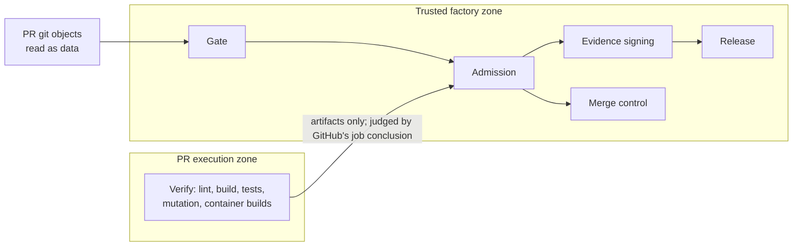

| | Trusted factory zone | PR execution zone |
| --- | --- | --- |
| Runs | Gate, admission, evidence collector and signing, release, queue controller | The PR's lint, build, tests, mutation runs and container builds |
| Code comes from | The base branch | The PR |
| Credentials | Factory App key, signing key, write access to caches and registry | None that outlive the job; no production secrets; read-only package and image access |
| Cache | Writes the trusted cache (`main` only) | Reads the trusted cache, writes nothing trusted |
| Lifetime | Long-lived runners allowed | Ephemeral: the runner or pod is destroyed after each job |

### The gate runs no PR-controlled code

The gate used to check out the PR and run `npm ci` and Nx there before the base branch's rules had classified it. A PR that crossed boundaries (product code plus `package.json`) was rejected correctly, but only after its install had run.

The gate now takes the PR as data and nothing else:

- **Git objects, not the working tree.** Changed paths come from `git diff`; `service.yaml`, `project.json`, the files tests are linted from, and the toolchain setup are read with `git show` at the PR's commit.
- **The graph and the affected set are computed in Python** from those declarations ([`graph.py`](../ci/factory/factory/graph.py)), the same graph the Nx plugin builds. No npm, Nx, shell script, interpreter or container build from the PR runs in the gate job.
- **Conservative where Nx is smarter.** A change to `nx.json`, `package.json`, `package-lock.json`, `.node-version` or the Nx plugin affects every project. A project the PR deletes still counts as changed, and so do the projects that depended on it. A project too many costs compute; a project too few ships a defect.
- **The gate's own code runs isolated** with `uv run --frozen --no-config` from the base branch, so a config file in the PR can't change how it starts.
- **Bootstrap.** While the base branch has no isolated gate, the workflow falls back to the PR's gate code, with a warning. That happens once, in the PR that introduces it, which is R3 and needs a human.

Verify still runs the Nx graph itself, as hostile code. The [validation suite](#dependency-graph-validation) keeps the two graphs from disagreeing.

### Verify is hostile: trusted and untrusted execution

Verify has to run the PR's code. The design question is what that code can reach.

- **No registry login in the PR's reach.** Toolchain images are pulled before any PR command runs, and the Docker credentials are removed from the runner before the first PR command. The job token has `packages: read` only.
- **BuildKit.** The BuildKit client key is written to the runner for the job. Where it can't be avoided, the PR instance is the read-only one (PRs and the queue read the layer cache, only `main` writes), its key is scoped to that instance, short-lived, and the instance is reachable only from the PR runner pool. A PR that steals it can read a cache of public-to-the-repo content and nothing else.
- **Separate runner pools, separate namespaces.** Templates in `platform/` describe, and apply nothing: a namespace for PR execution and one for the trusted factory, a service account per zone, and network policies. PR pods get DNS, the package mirror and the BuildKit PR instance; no route to the trusted namespace, the evidence bucket, the cluster API or cloud metadata. Pods are destroyed after one job. Distinct node pools are an option for organizations that want hardware separation.
- **Results are not trusted.** Admission already reads job conclusions from GitHub. Records and measurements from the PR zone are inputs, never decisions.

### Dependency graph validation

The scaling model depends on `nx affected` being right. A false positive costs compute and a false negative ships a defect, so the graph is a safety property and gets more tests than the orchestration around it.

A validation suite runs the change analyzer on a fixture repository with deliberately awkward cases and asserts the blast radius: dynamic imports, generated sources, Node workspace dependencies, OpenAPI consumers, protobuf generation, container `COPY` paths, Helm values and templates, shared generated code, and runtime `consumes` relationships. Each case is also mutated (an edge removed, a path renamed) to check the analyzer never reports less than before. The same suite compares the Python graph with `nx graph` on the real workspace and fails on any difference.

### Policy maturity profiles

Evidence modes come from a profile, so the intended end state is visible without being active:

```text
template defaults  ->  observe  ->  organization calibrates  ->  enforce
```

| Profile | Used when | Evidence |
| --- | --- | --- |
| `template` | Default. Always active in this repository | The modes in `evidence.yaml` today: new evidence in shadow |
| `production-example` | Never active by default; an organization copies it as a starting point | Dependency rules, diff coverage, contract tests and selected integration tests enforce; broad integration and owner approval enforce for R3; mutation score stays shadow longer |

The profile is named in one place in `ci/policy/`, a shadow-to-enforce change stays a reviewed PR, and a check that records what each profile would have blocked lets an organization see the effect before it flips anything. The README says plainly that shadow checks are safe template defaults, not unfinished enforcement.

### Evidence identity

Evidence is identified, not just attached to a commit:

```text
Evidence = repository + tree SHA + commit SHA + policy version + toolchain version
         + execution environment + validator version + result
```

Admission then means: the required evidence exists for this exact state under this exact policy. Policy version is a hash of `ci/policy/`; toolchain version is the pinned image digests; execution environment is the runner pool and image; validator version is the factory code revision that produced the record. Evidence made under another policy or toolchain does not satisfy admission, which matters when hundreds of agent revisions are in flight and a rule change lands between them.

### Metric-driven agent trust

The levels stay `experimental`, `observed`, `trusted`, `autonomous`, and R3 always needs a human. What changes is that moving between them follows measured numbers from the evidence index, with the thresholds in `agents.yaml`:

- **Promotion** needs a minimum number of accepted changes, escape rate and revert rate under their limits, no policy violations over a threshold, no critical escape, and a minimum time observed at the current level. Example for `trusted` to `autonomous`: 500 accepted changes, escape rate under 0.5%, revert rate under 1%, 60 days.
- **Demotion is automatic.** A critical escape demotes immediately; an escape rate over its limit demotes one level.
- **A report** shows every agent's numbers and the next level's gap, so trust is an operational reliability measure and not a label.

### Queue load simulation

The capacity formula assumes independent failures and stable validation time. Real load is bursty: 150 overnight agent changes becoming ready at 09:00, a shared library change affecting 62 services, a toolchain update affecting everything. A simulator drives the queue model with synthetic workloads at 300, 500, 1000 and 1500 PRs a day, with an R0 to R3 mix, varied affected-project counts, flakes, failures, conflicts and arrival bursts, and reports p50/p90/p99 admission and queue latency, runner saturation, rebuild share, relative cost per PR and human wait time. Production sizing is not approved until this has run against the organization's own numbers.

### SCM adapter

The factory core (risk, boundaries, evidence, agent trust, admission, capacity logic) decides; it must not depend on `gh` or GitHub's JSON. It talks to one interface, [`SCM`](../ci/factory/factory/scm/base.py), so the core can be tested against a fake platform and the platform calls live in one place:

```text
Factory core -> SCM adapter -> GitHubAdapter
get_change()  get_changed_files()  get_approvals()  get_job_results()  get_run()
publish_decision()  enqueue_change()  and the listings the controllers need
```

`GitHubAdapter` implements it with `gh` and the REST and GraphQL APIs. The repository stays on GitHub. A test fails if `gh` appears in the core outside the adapter, the release job and the ruleset sync, which remain GitHub-specific platform integrations.

### Parallel merge lanes

One GitHub merge queue per branch can't carry 2,000 to 4,000 PRs a day unless every queue run takes only a few minutes: with 15-minute runs it tops out at about 185 PRs an hour, and with 45-minute runs at about 62, even building 100 entries at once ([capacity doc](merge-queue-capacity.md#at-higher-pr-rates)). The boundaries make a way out possible: PRs that can't affect each other don't need to be tested together.

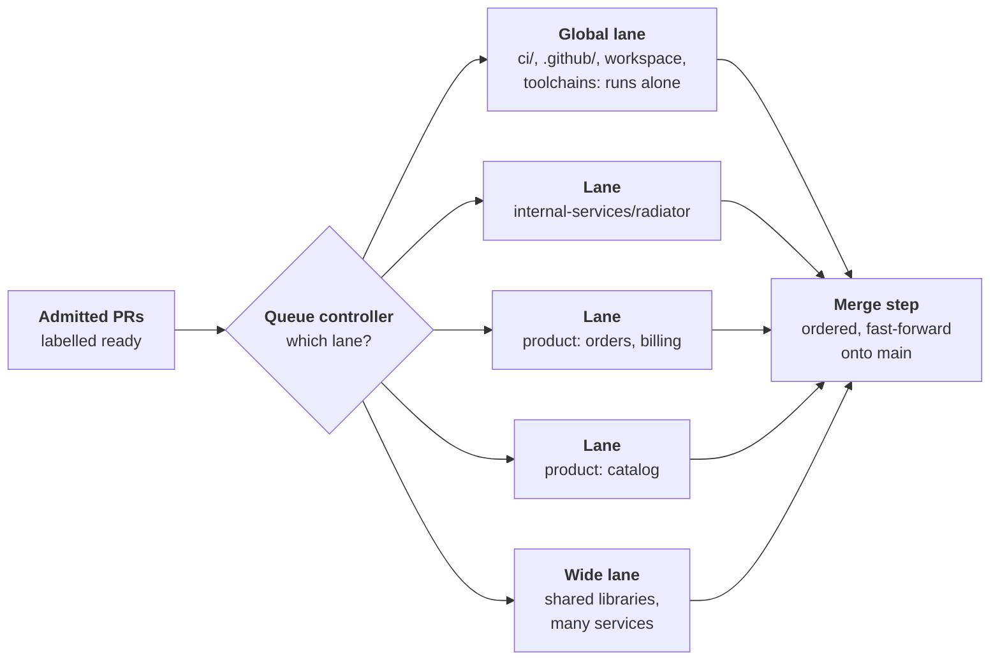

**How a PR gets its lane.**

- **Outside `product/`, one lane per boundary or sub-boundary.** A PR stays inside one boundary, and boundaries depend on each other only through released versions and contracts, so an `internal-services/radiator` PR can't break an `internal-tools/<tool>` build.
- **Inside `product/`, by affected projects.** The gate already computes each PR's affected set. Two product PRs whose affected sets don't overlap go in different lanes; a PR that overlaps a lane joins it. Lanes are formed per batch from what is ready, not fixed in advance.
- **A wide lane** takes PRs whose affected set is large (a shared library, more than `affected_projects_over` projects), so one wide PR doesn't merge several lanes into one.
- **Risk tier is not a lane key.** Two R1 PRs in the same service can still break each other, so lanes follow what a PR affects, not its tier. Tier still shapes lanes indirectly: R3 changes mostly land in the global lane, and R2 changes to shared libraries and contracts in the wide lane, so the slow, failure-prone runs stay out of the narrow lanes.
- **The global lane** takes changes to `ci/`, `.github/`, the workspace files and toolchains, which affect every project. It runs alone while the other lanes pause, as rule changes and off-peak workspace changes already do.

**How a lane runs.** Each lane is a small merge queue: it builds up to `B` entries, each on top of `main` plus the entries ahead of it in the same lane, and ejects a failure and rebuilds only that lane's entries behind it. GitHub's merge queue can't do this (one queue per branch, and a failure rebuilds everything behind it), so the queue controller runs the lanes itself: it creates the lane's candidate commits, triggers the factory on them and reads the results, the way the `merge_group` event does today. Commercial queues offer the same idea under other names, which an adopter can use instead.

**How lanes merge.** A merge step takes passed entries from the lanes in order and fast-forwards `main` with each squash commit. A lane's result stays valid on top of another lane's commit because their affected sets don't overlap; the merge step checks that by tree, file by file, and sends an entry back to its lane if another lane changed any of its affected projects in the meantime. Evidence carries over only on that proof, as it does today for the merge queue.

**What can still slip through.** Two lanes can interact at run time in a way the project graph doesn't show, such as an undeclared call between services. Contract tests against released N and N-1 versions cover declared calls; the post-merge check on `main` catches the rest and the factory reverts automatically, as it does today. A rising number of cross-lane reverts means the graph is missing edges, and the [dependency graph validation](#dependency-graph-validation) is where that gets fixed.

**What it buys.** Throughput adds up across lanes, and a failure only restarts entries in its own lane. From the formula, 10 lanes of 10 entries give about 360 PRs an hour with 15-minute runs, against 36 for one queue of 10. In the [queue load simulator](merge-queue-capacity.md#parallel-lanes) with equal lanes, 4,000 PRs a day in 20 lanes of 10 with 15-minute runs wait 23 minutes at the median and 38 at p90. How evenly `product/` splits decides how close a real setup gets.

**Order of work.** Keep GitHub's queue and shorten queue runs first, since that is cheaper and covers up to about 2,000 a day. Build lanes when the simulator, run with the organization's own numbers, shows one queue can't keep the p90 queue wait inside its target.

### Later

Documented, not built:

- **Untrusted PR cache with promotion.** At 300 to 1000 PRs a day, rebuilding what the PR already built in the queue gets expensive. PRs would write only to `untrusted/<commit-sha>/`, never to the trusted namespace, and after verification the factory would promote immutable, content-addressed artifacts by digest instead of recomputing them. Not needed for the template.
- **Real deployment.** Delivery stops at versioned artifacts and a simulated preview deploy. Environments, promotion between them and rollback are an adopter's decision.
