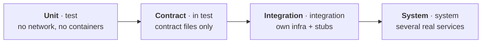

# Test infrastructure guidelines

> **Status:** proposal, docs only. Nothing here is built yet; the steps at the end deliver it one boundary at a time. Part of the [CI/CD skeleton plan](ci-cd-skeleton-plan.md#test-infrastructure).

How tests get what they depend on: databases, queues and caches, other services, external SaaS, test data and test identities. The goal is that every test result is evidence the factory can trust: the same on a laptop, on a public runner and in an air-gapped network, and the same for the 1st and the 300th agent running at once.

**Contents**

1. [What is shaky today](#what-is-shaky-today)
2. [Principles](#principles)
3. [Test levels are set by infrastructure](#test-levels-are-set-by-infrastructure)
4. [Declaring what a service needs](#declaring-what-a-service-needs)
5. [Ephemeral infrastructure per run](#ephemeral-infrastructure-per-run)
6. [Other services: stubs from contracts](#other-services-stubs-from-contracts)
7. [External services](#external-services)
8. [Test data](#test-data)
9. [Test identities and secrets](#test-identities-and-secrets)
10. [Determinism](#determinism)
11. [Infrastructure failures are not test failures](#infrastructure-failures-are-not-test-failures)
12. [Caching, tiers, queue and budgets](#caching-tiers-queue-and-budgets)
13. [Runners: public and air-gapped](#runners-public-and-air-gapped)
14. [Delivery steps](#delivery-steps)

## What is shaky today

| Finding | Where | Why it matters |
| --- | --- | --- |
| The plan says test levels are "enforced by the toolchain", but each toolchain has one `test` target and nothing checks what a test uses | `internal-tools/toolchains/*/toolchain.yaml` | A unit test can open a socket, start a container or sleep, and nobody notices until it flakes |
| Nothing produces the `integration-selected` and `integration-broad` evidence | `ci/policy/evidence.yaml`, `.github/workflows/factory.yml` | R2 and R3 list evidence that can never exist. The `template` profile passes only because both are in shadow mode, and the `production-example` profile enforces both, so an adopter switching to it would block every R2 and R3 PR |
| `test-framework/` is in the invariants and risk rules but doesn't exist | `ci/policy/invariants.yaml`, `ci/policy/risk.yaml` | There is no shared place for test infrastructure, so the first service that needs a database invents its own way |
| No service declares `data:`, although the invariants rely on it | `service.yaml` files | There is no convention for a database, queue or cache in tests |
| Targets run in pinned images through `docker run` with no Docker socket and the default network | `internal-tools/toolchains/in-image.sh` | Tests that start their own containers (Testcontainers style) can't work in CI, and if they did they would pull unpinned images from docker.io, breaking the pins and the air gap |
| The contract check only looks for files | `ci/factory/factory/contracts.py` | It proves a contract test exists, not that it tests the provider's real contract |
| `radiator-web` tests against a hand copy of `radiator-api`'s `openapi.json` | `internal-services/radiator/web/src/contracts/radiator-api/` | The copy can drift from the API and the consumer test stays green |
| `order-simulator` reads `orders`' contract from source at `HEAD`, across boundaries, while `pins.yaml` says it is verified against `orders` 0.1.7 | `internal-services/order-simulator/tests/contracts/orders/` | It tests a contract it doesn't run against, and breaks the "consume releases, not source" rule |
| Python unit tests download `pytest-cov` at test time | `internal-tools/toolchains/python/toolchain.yaml` (`uv run --with pytest-cov`) | Unit tests need the package index, so they can't run with the network off |
| Nightly promises full contract and integration suites | plan, "How nightly runs work" | Only unit tests and mutation run |
| No rule for test data, external SaaS or test identities | | Each team decides alone; shared state and real credentials are the usual result |

## Principles

1. **Hermetic by default.** A test gets only what the factory gives it. No internet, no shared environment, no real credentials.
2. **Declared, not discovered.** A service lists the infrastructure it needs in `service.yaml`. The factory starts it; test code doesn't.
3. **Ephemeral and private per run.** Every run starts its own infrastructure and throws it away. Nothing is shared between runs, PRs or agents.
4. **Pinned like the toolchains.** Every infrastructure image is built or mirrored by the repo and pinned by digest, so the air-gap switch covers it too.
5. **Other services come from their contracts.** Up to integration level, another service is a stub built from its published contract, at the version the consumer pins.
6. **A failure says whose it is.** Infrastructure failures are reported as such and never count against a service's tests.

## Test levels are set by infrastructure

A test's level is decided by what it needs, not by what it is about. Each level is its own Nx target, so `nx affected` selects it and the toolchain can enforce its limits.

| Level | Nx target | May use | Runs | Evidence |
| --- | --- | --- | --- | --- |
| Unit | `test` | Process memory and files in the project. No network, no containers, no sleeps | Every PR from R1, every queue batch | `unit-tests`, `diff-coverage`, `mutation-score` |
| Contract | inside `test` | Contract files: the provider's own, and consumers' contracts in the repo | With unit tests from R1 | `contract-tests` (R2 up) |
| Integration | `integration` | The service's own declared infrastructure, started per run, plus stubs of the services it consumes | Affected projects from R2; nightly for all | `integration-selected` |
| System | `system`, in `product/tests/system/<suite>/` | Several real services from the images built in this run, with their infrastructure | R3 and nightly | `integration-broad` |



- **Contract tests stay file-based.** They need no infrastructure, so they run with the unit tests and stay cheap. That keeps the R2 budget for integration.
- **Unit tests run with the network off.** In image mode `in-image.sh` runs the `test` target with `--network none`. A unit test that reaches for the network fails at once, on the developer's PR, instead of flaking later.
- **A test that needs more moves up a level.** The fix for a unit test that needs a database is to move it to `integration`, not to give `test` a database.

## Declaring what a service needs

A service names its infrastructure in `service.yaml`, next to what it consumes:

```yaml
# product/services/orders/service.yaml
name: orders
consumes: [catalog]          # stubbed from catalog's contract in integration tests
data:
  - kind: postgres           # test-framework/infra/postgres, pinned by digest
    migrations: migrations/  # applied to a fresh database on every run
  - kind: redis
```

- **Kinds live in `test-framework/infra/<kind>/`.** Each kind has an `infra.yaml` with the image pinned by digest, the readiness check, the environment variables it hands to tests (`FACTORY_INFRA_POSTGRES_URL`) and a startup budget, plus a container test that checks all of that. Adding a kind is one folder, like adding a toolchain.
- **Few kinds, owned centrally.** The CI/platform team owns the shared kinds (Postgres, Redis, Kafka or NATS, S3-compatible storage, the identity fake). A team that needs something rarer adds a kind through a `test-framework/` PR; it doesn't start containers from its tests.
- **The same declaration serves production.** `data:` is what the invariant "each service owns its data" checks, so a service can't quietly read another service's database in tests either.
- **A kind change re-tests its users.** The plugin adds an implicit Nx edge from every service that declares a kind to that kind's folder, so moving the Postgres pin re-runs `integration` for every Postgres service before it merges, as a toolchain pin does.

## Ephemeral infrastructure per run

The toolchain's `integration` target wraps the test command in a launcher from `test-framework/`:

1. Create a Docker network for this run and project, marked `--internal` so nothing on it reaches the internet.
2. Start each declared kind on it from its pinned image, with a random name and no published ports.
3. Wait for each readiness check, within the kind's startup budget.
4. Apply the service's migrations to a fresh database.
5. Run the test command on the same network: in image mode, `in-image.sh` attaches the toolchain container to it; on the host, the launcher publishes ports on localhost instead.
6. Remove everything, pass or fail. Containers carry the run ID as a label, so a reaper on each runner removes anything a killed job left behind.

- **No shared environments for evidence.** A long-lived test database, a shared staging stack or a team namespace never produces merge evidence. With 300 agents pushing at once, shared state is the biggest source of flakes and of one PR breaking another.
- **Parallel without collisions.** Each run and shard has its own network and containers, so any number of runs can share a runner host.
- **Same command locally.** `npx nx run orders:integration` does the same on a laptop with Docker. Agents run it in their sandbox before pushing an R2 change, when the sandbox has Docker.
- **Test code never starts containers.** Libraries like Testcontainers are not used directly: the launcher keeps image pins, the air-gap swap, cleanup and failure reporting in one place for every language.

## Other services: stubs from contracts

Up to integration level, a service never calls another real service.

- **Stubs come from the contract.** For each `consumes` edge the launcher starts a stub server from the provider's published contract (its OpenAPI file or event schema) on the run's network, and hands its address to the test as `FACTORY_STUB_<SERVICE>_URL`. Tests add response examples through the stub's API when they need specific data.
- **Inside `product/`, the contract at `HEAD`.** Product services change together and share source, so a product consumer uses the provider's contract file as it is in the same commit, and Nx re-tests the consumer when it changes.
- **Across boundaries, the released contract.** An internal service or tool uses the contract of the provider version it pins in `pins.yaml`, published with that release. The promotion bot's bump PR moves the pin and runs the consumer's tests against the new contract. `order-simulator` should read `orders`' contract this way instead of from source.
- **No hand copies.** A contract file copied into a consumer must be the published artifact at a pinned version, checked by hash, never a copy edited by hand. `radiator-web` either reads `radiator-api`'s `openapi.json` from source (same boundary) or pins a released one.
- **The provider checks its consumers.** A provider's `test` target runs every consumer contract in the repo that names it against its real handlers, as `catalog` does for `orders`. That, not the stub, is what proves the stub is honest.
- **System tests use the real thing.** Only the `system` level runs several real services together, from the images this run built.

## External services

Third-party services (payments, email, maps, an upstream SaaS API) are never called from a run that produces evidence.

- **Fakes in `test-framework/fakes/<vendor>/`.** A fake implements the part of the vendor's API the product uses, from the vendor's published API description, and runs as a kind like any other.
- **Live checks are separate and never block.** An optional nightly job on `main` runners, which hold the secrets, calls each vendor's sandbox and compares its answers with the fake. A difference opens an issue on the fake's owners; it never blocks a merge.

## Test data

- **Each test owns its data.** A test creates what it needs, uses keys unique to the test and run (prefix with `FACTORY_RUN_ID`), and doesn't depend on test order or on data another test left.
- **The schema comes from the service's migrations.** Every integration run applies the real migrations to an empty database, so the migrations are tested on every run.
- **Fixtures are small, synthetic files.** Seeds live in the project's `testdata/` folder, are reviewed like code and are part of the target's Nx inputs.
- **Larger data is generated.** A team that needs volume uses a generator it owns under `internal-tools/` or `internal-services/`, with a fixed seed so the data is the same on every run.
- **Never production data.** No copies or extracts of production data, and no personal data, anywhere in the repo or in a test run.

## Test identities and secrets

- **No real credentials in any test.** PR and merge queue runners already hold no secrets, and tests must not need any.
- **A fake identity provider.** `test-framework/infra/identity` is an OIDC issuer that makes its signing keys at start-up and issues tokens for test users and service accounts that tests create per run. Services validate tokens against it exactly as they would against the real issuer, so auth code (`**/auth/**`, R3) is tested with real token checks.
- **Fresh identities per run.** No shared test users, no fixed passwords, nothing that two runs could both change.
- **Human and agent accounts are never test identities.** The GitHub accounts in `ci/policy/agents.yaml` identify who made a change; they never log in to anything a test starts.

## Determinism

- **Time is injected.** Code takes a clock, and tests set it. No test depends on the wall clock or the time zone.
- **Randomness is seeded.** Seeds are logged with the result, so a failure can be replayed.
- **Wait on conditions, never sleep.** Integration tests poll for a state with a timeout; the test quality check should flag a fixed sleep in changed tests.
- **Everything is pinned.** Infrastructure images by digest, stub and fake images by digest, contracts by version or commit, so a re-run of the same commit tests the same thing.

## Infrastructure failures are not test failures

The launcher reports each failure as one of two kinds:

| Kind | Examples | What the factory does |
| --- | --- | --- |
| `infra-error` | Image pull fails, container doesn't start, readiness timeout, runner out of disk | Retries the target once on a fresh network. Records it against the platform, never in the service's flake rate, quarantine or escape count. Repeated errors alert the CI/platform team |
| Test failure | An assertion fails, the service crashes, a test times out after readiness | Handled like any failed test: retried once, then the existing flake confirmation and quarantine rules |

Without this split, a slow Postgres start on a busy runner would quarantine a service's good tests and raise its risk tier.

## Caching, tiers, queue and budgets

- **Cache inputs include the infrastructure.** The `integration` target's Nx inputs are the project's inputs plus the `infra.yaml` of each declared kind, the migrations and fixtures, and the consumed contracts at their pinned versions. A pin change can't be hidden by a cache hit. As today, only `main` builds write the cache.
- **Selection follows the tiers.** R1 runs `test`. R2 adds `nx affected -t integration` as `integration-selected`. R3 adds the `system` suites that cover an affected project as `integration-broad`. Nightly runs every `integration` and `system` target.
- **The queue re-runs what the tier requires** on the batch, so `main` only gets integration evidence for the exact squashed result.
- **Start-up counts in the budget.** The integration budget (15 min p90, 30 min hard) includes starting infrastructure. Each kind's startup budget is checked by its own container test, so a slow image is caught when it is pinned, not in everyone's PR.
- **Shadow first.** `integration-selected` and `integration-broad` stay in shadow mode until the targets exist and their shadow results show no false blocks, as the evidence policy already says for new checks. Until then the `production-example` profile in `ci/policy/evidence.yaml` should not list them under `enforce`.

## Runners: public and air-gapped

- **Public GitHub-hosted runners work as they are.** They have Docker, so the launcher's networks and containers run there, and the infrastructure images come from GHCR next to the toolchain images.
- **Self-hosted runner pools need a Docker daemon for integration.** The PR and queue pools in `platform/runners/` get a Docker-in-Docker sidecar per runner pod, with its own storage and no secrets, so a run's containers die with the pod. Infrastructure images are pre-pulled into the runner image so start-up doesn't wait on the registry.
- **Air-gapped, optional.** Infrastructure images are mirrored with the toolchain images, and `FACTORY_TOOLCHAIN_REGISTRY` swaps the registry for them too, keeping the digest. The network policy check covers `test-framework/infra/*/infra.yaml` like `toolchain.yaml`. The run's `--internal` network means a test can't reach outside even on a public runner.

## Delivery steps

One PR per step, each in one boundary:

| Step | Boundary |
| --- | --- |
| These guidelines and the plan section | Docs |
| `test-framework/`: the launcher, the `postgres` kind and the identity fake, each with a container test | Test framework |
| Toolchains: the `integration` target, `data:` edges in the plugin, `--network none` for `test` in image mode, `pytest-cov` in the Python image instead of fetched at test time | Internal tool |
| `radiator-web` stops hand-copying `radiator-api`'s schema | Internal service |
| `order-simulator` tests against the released `orders` contract it pins | Internal service |
| Verify runs `integration` from R2 and records `integration-selected`; nightly runs every `integration`; the network check covers `infra.yaml` | CI |
| Runner pools get the Docker-in-Docker sidecar and pre-pulled infrastructure images | Platform |
| A first product service with a database, for example `orders` with Postgres | Product |
| `integration-selected` moves to enforce once shadow shows no false blocks | CI |
